

  

  

# Documentación EchoNow

EchoNow es una aplicación de comunicación en tiempo real que permite a los usuarios
crear canales de voz y texto, gestionar notificaciones y realizar llamadas.
Este documento describe la arquitectura, funcionalidades actuales y futuras
mejoras del proyecto.   
## Licencia

Esta obra está bajo una licencia Reconocimiento-Compartir bajo la misma licencia 3.0 España de Creative Commons. Para ver una copia de esta licencia, visite [Licencia CC](http://creativecommons.org/licenses/by-sa/3.0/es/) o envíe una carta a Creative Commons, 171 Second Street, Suite 300, San Francisco, California 94105, USA.  

## Índice de Contenido
1. [Introducción y Justificación](#introducción-y-justificación)
	1. [Memoria Inicial](#memoria-inicial)
	2. [Estudio del Sector](#estudio-del-sector)
	3. [Análisis de Viabilidad](#análisis-de-Viabilidad)
	4. [Herramientas y Tecnologías](#herramientas-y-tecnologías)
2. [Definición del Sistema](#Definición-del-Sistema)
	1.  [Objetivos del Proyecto](#Objetivos-del-Proyecto)
		1. [Objetivo General](#objetivo-general)
		2. [Objetivos Funcionales](#objetivos-funcionales)
	2. [Definiciones de Actores](#definiciones-de-actores)
	3. [Especificación Funcional](#especificación-funcional)
		1. [Diagrama de Casos de Uso](#diagrama-de-casos-de-uso) 
		2. [Tablas de especificación de Casos de Uso](#tablas-de-especificación-de-casos-de-uso)
	4. [Requisitos del Sistema (SRS)](#requisitos-del-sistema-srs)
		1. [Requisitos Funcionales (RF)](#requisitos-funcionales-rf)
		2. [Requisitos No Funcionales (RNF)](#requisitos-no-funcionales-rnf)
		3. [Requisitos de Información (IRQ)](#requisitos-de-información-irq)
	5. [Normativa y Legislación](#normativa-y-legislación)   
3. [Diseño Tecnológico y Arquitectura](#Diseño-Tecnológico-y-Arquitectura)
	1. [Arquitectura del Software](#arquitectura-del-software)  
	2. [Diseño de Datos](#diseño-de-datos)  
		1. [Diagrama de Modelo Relacional](#diagrama-de-modelo-relacional)  
		2. [Diagrama de clases UML](#diagrama-de-clases-UML)  
	3. [Diseño de Interfaz](#diseño-de-interfaz)  
4. [Planificación y Metodología](Planificación_Metodologia.md)  
	1. Metodología de Trabajo  
	2. Planificación Temporal (Gantt)  
	3. Guion de Trabajo  
5. [Desarrollo e Implementación](Desarrollo_Implementacion.md)
	1. Organización real del trabajo  
	2. Estructura del Proyecto  
	3. Aspectos relevantes de la codificación  
	4. Despliegue  
	5. [Plan de Prevención de Riesgos Laborales](#plan-de-prevención-de-riesgos-laborales)
6. [Pruebas y Control de Calidad](Pruebas_Control_Calidad.md)
	1. Plan de Pruebas  
	2. Registro de Incidencias  
	3. Validación de Requisitos  
7. [Conclusiones y Futuro](Conclusiones_Futuro.md)
	1. Grado de cumplimiento de objetivos.  
	2. Dificultades y aprendizaje personal.  
	3. Posibles mejoras y líneas futuras del proyecto.  
8. [Referencias y bibliografía](Referencias_bibliografía.md)
9. [Glosario de Términos y Acrónimos](#glosario-de-términos-y-acrónimos)
10. [Anexos](Anexos.md)
	1. Manual de instalación  
	2. Manual de usuario  
	3. Documentación complementaria digital  
	4. Anexos técnicos y documentales  

---
## Índice de Figuras  

---  

## Índice de Tablas

---

## Identificación del Proyecto  

**Autor:** Antonio José Blázquez Jiménez
**Ciclo:**  Desarrollo de Aplicaciones Web  
**Responsable:** Serafina Martín Marcos  
**Institución:** I.E.S. VENANCIO BLANCO, SALAMANCA

---  

# Introducción y Justificación

En este primer entregable sentaré las bases de todo el desarrollo. Justificaré el "qué", el "por qué" y el "cómo" de mi proyecto. El documento cubrirá los siguientes **5 puntos clave**

## Memoria Inicial 
**Idea del proyecto💡:**  
En primer lugar EchoNow es una aplicación dedicada a la comunicación entre los usuarios a tiempo real.
Es una aplicación minimalista que contiene lo esencial para poder mantener conversación con todo tipo de usuarios, grupos de usuarios o servidores, donde deberemos de estar registrados para poder hacer uso de la aplicación. La aplicación en principio contara con **2 principales formas de comunicación**
- **Comunicación Escrita ✏️**:  
Nos podremos comunicar con otros usuarios vía texto, como en una conversación típica en un dispositivo móvil. Este apartado no contará con latencia perceptible entre mensajes, lo que significa que los mensajes se mostrarán de manera prácticamente instantánea sin necesidad de refrescar el servicio.  

La latencia de los mensajes estará determinada principalmente por el **RTT (Round Trip Time)** entre el cliente y el servidor, así como por la **calidad y estabilidad de la conexión de banda ancha del usuario**, factores que afectan el tiempo que tarda un mensaje en viajar desde el remitente hasta el destinatario y recibir la confirmación de entrega.
  
- **Comunicación Oral 🔊**:  
Además los usuarios podrán tener acceso a llamadas y diálogos mediante los servicios de la aplicación. Mas tarde veremos las opciones que tenemos en este apartado de poder crear llamadas con usuarios grupos o servidores.  

Por otro lado la aplicación **podrá conectarse de 3 formas distintas** estas formas de conexión estan íntimamente ligadas con las formas de comunicación, de manera que las **3** formas de conexión que existen deberían de poder hacer uso de las **2 comunicaciones** existentes.  
- **Entre Usuarios 👤:**  
La conexión entre usuarios es muy simple, se establecería un canal / chat donde solamente 2 usuarios puedan dialogar en ese mismo contexto.  

- **Mediante Grupos 👥:**

La conexión mediante grupos funciona de manera similar a la anterior nombrada, con la diferencia de que en vez de poder funcionar con **2 usuarios** únicamente, este normalmente contará con un número definido de usuarios. Además para formar parte de un grupo el anfitrión o administrador del grupo *(normalmente el fundador del grupo)* deberá de invitarte para poder acceder al grupo.

- **Mediante Servidores 🌐:**
La conexión mediante servidores funciona de manera simular a los [grupos](#mediante-grupos) la única diferencia es que cualquier persona con una invitación o a través de un link de tipo *URL* podría acceder y comenzar a dialogar. Además un servidor puede contar con varios canales *un canal es lo mismo que una conversación* estos canales estarán aislados unos de otros donde no los mensajes que se manden por cada canal serán independientes entre canales. Otra de las diferencias es que los los canales serán manejados mediante roles. Los cuales estarán directamente vinculados con cada usuario del servidor. Mas tarde hablaremos sobre ellos  

## Justificación  
EchoNow soluciona problemas complejos a la hora de comunicarse con otros individuos gracias a su interfaz simple, su gran intuición para acceder a paneles de navegación y sobre todo por su simpleza, ya que EchoNow une todas las herramientas imprescindibles para un mejor espacio de trabajo / ocio.

## Oportunidad de negocio  
Las oportunidades de negocio que existe como proyecto emergente dependen mucho según el desarrollo y los caminos que tome el proyecto, ya que en principio una aplicación de comunicaciones nueva suele ser una muy buena opción para usuarios que quieran cambiar su forma de comunicación.  
Dentro del mercado nacional e internacional de las plataformas de [VOIP](#glosario-de-términos-y-acrónimos) en un principio sí que se podría contar con un hueco para nuestra aplicación, ya que tiene varios aspectos que solucionarán problemas de una gran parte de usuarios. 

## Estudio del Sector  

1. **Aplicaciones similares**

	Las aplicaciones más conocidas con funcionalidades similares a **EchoNow** son:  
	**Discord, WhatsApp, Telegram, TeamSpeak, Instagram, Signal, Slack y Microsoft Teams**, entre otras.  

	---
	### Discord  

	**Elementos considerados saturados o innecesarios:**

	- Barra lateral izquierda con múltiples servidores visibles simultáneamente.
	- Panel secundario con canales y subcanales.
	- Panel derecho con lista completa de usuarios conectados.
	- Iconos constantes de notificaciones y estados.
	- Integraciones visibles como juegos, bots, eventos o funciones premium.

	**Análisis crítico:**  
	La presencia simultánea de varios paneles fragmenta la atención del usuario y genera una sobrecarga visual. La interfaz prioriza la cantidad de funciones frente a la claridad.

	**Justificación**  
	EchoNow reducirá la interfaz a una conversación activa principal, ocultando paneles secundarios hasta que el usuario los necesite.

	---

	### WhatsApp

	**Elementos mejorables:**

	- Sección de estados (Stories) integrada en la pantalla principal.
	- Acceso visible a comunidades y canales.
	- Iconos permanentes de llamada y videollamada.

	**Análisis crítico:**  
	Se mezcla la mensajería directa con elementos propios de redes sociales, lo que desvía la atención del objetivo principal: la conversación.

	**Justificación**    
	Se eliminarán funciones sociales no esenciales para mantener el foco en la comunicación directa.

	---

	### Telegram

	**Elementos saturados:**

	- Canales públicos promocionales.
	- Bots visibles dentro de conversaciones.
	- Sistema de carpetas múltiples para chats.
	- Publicidad en canales de gran tamaño.

	**Análisis crítico:**  
	La gran cantidad de funciones avanzadas visibles desde el inicio puede resultar abrumadora para nuevos usuarios.

	**Justificación**    
	Las funciones avanzadas estarán disponibles únicamente bajo demanda y no saturarán la interfaz principal.

	---

	### Slack y Microsoft Teams

	**Elementos recargados:**

	- Integraciones empresariales visibles (Drive, Planner, GitHub, etc.).
	- Barra lateral con múltiples espacios de trabajo.
	- Secciones de actividad, menciones y archivos compartidos.

	**Análisis crítico:**  
	Son herramientas orientadas a entornos de trabajo, con una interfaz cargada de opciones que no siempre son necesarias para la comunicación directa.

	**Justificación:**  
	EchoNow prioriza simplicidad y comunicación fluida sobre integraciones empresariales complejas.

	---

	### Tabla comparativa de funcionalidades  

	| Funcionalidad                | EchoNow | Discord | WhatsApp | Telegram | Slack | Teams   | Signal |
	| ---------------------------- | ------- | ------- | -------- | -------- | ----- | ------- | ------ |
	| Chat privado                 | Sí      | Sí      | Sí       | Sí       | Sí    | Sí      | Sí     |
	| Servidores / Comunidades     | Sí      | Sí      | Limitado | Sí       | Sí    | Sí      | No     |
	| Canales organizados          | Sí      | Sí      | No       | Sí       | Sí    | Sí      | No     |
	| Roles jerárquicos            | Sí      | Sí      | No       | Básico   | Sí    | Sí      | No     |
	| Llamadas VoIP                | Sí      | Sí      | Sí       | Sí       | Sí    | Sí      | Sí     |
	| Interfaz minimalista         | Sí      | No      | Media    | No       | No    | No      | Sí     |
	| Sin publicidad o promociones | Sí      | No      | Parcial  | No       | Sí    | Sí      | Sí     |
	| Bajo consumo de recursos     | Sí      | No      | Medio    | Medio    | No    | No      | Sí     |
	| Integración opcional de IA   | Sí      | Bots    | Si       | Bots     | No    | Copilot | No     |
  
	---

2. **Necesidades actuales de los usuarios** 
   
	Tras analizar aplicaciones como Discord, WhatsApp o Slack, se detectan las siguientes necesidades no completamente cubiertas:  

	- **Interfaz más simple y minimalista**, sin funciones innecesarias que saturen al usuario.  
	- **Unificación de los servicios** entre chat privado, grupos y servidores
	- **Mejor organización de conversaciones** mediante canales estructurados. *(únicamente en servidores)*  
	- **Equilibrio entre uso profesional y personal**, sin estar enfocada exclusivamente a uno de los dos ámbitos.   
  
3. **Imágenes de aplicaciones similares**  
	Las imágenes que se muestran a continuación estan creadas desde la versión de escritorio de cada aplicación

	- Discord  
    	- Chat Individual  
			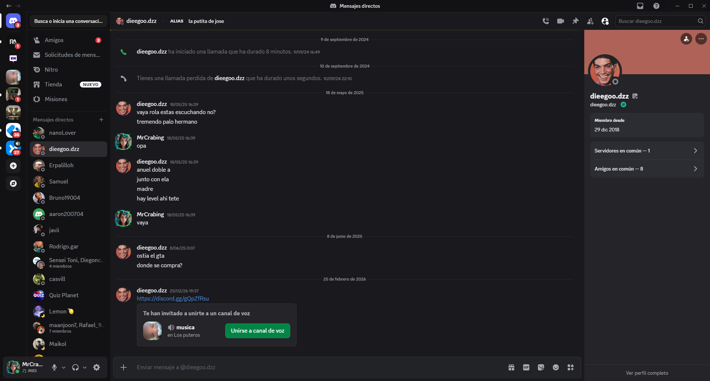  
		- Chat en Servidores  
			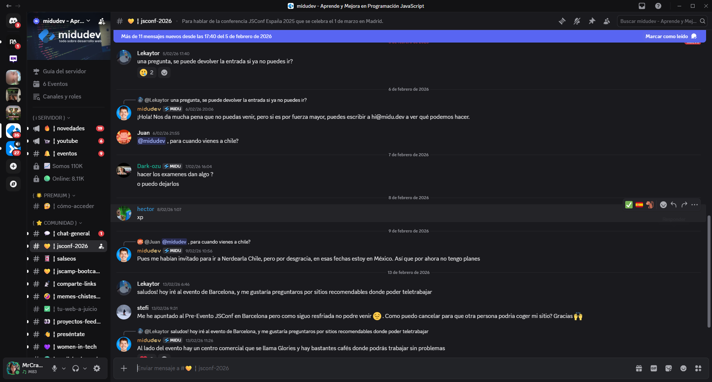  
		- Chat en Grupos  
			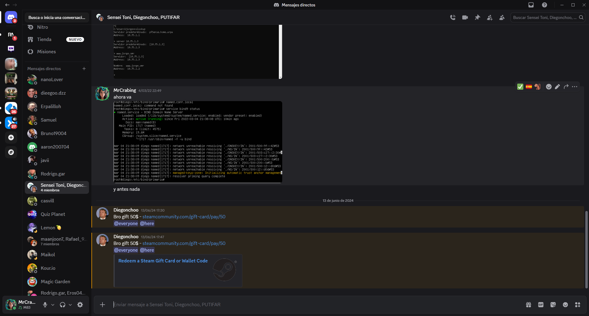  
	- WhatsApp  
		- Chat Individual  
			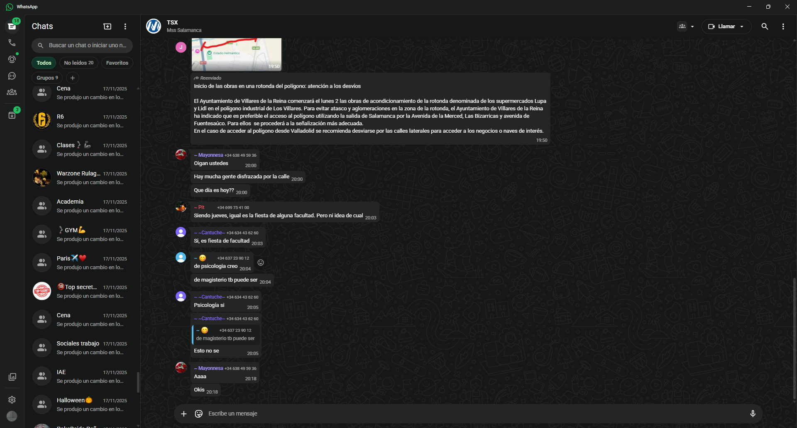  
		- Chat en Grupos  
			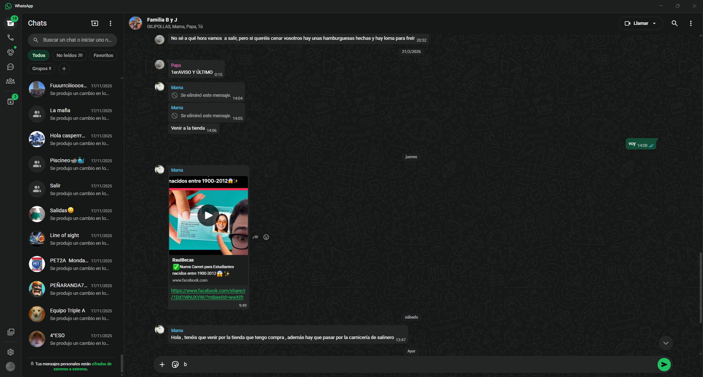  
		- Chat en Comunidades  
			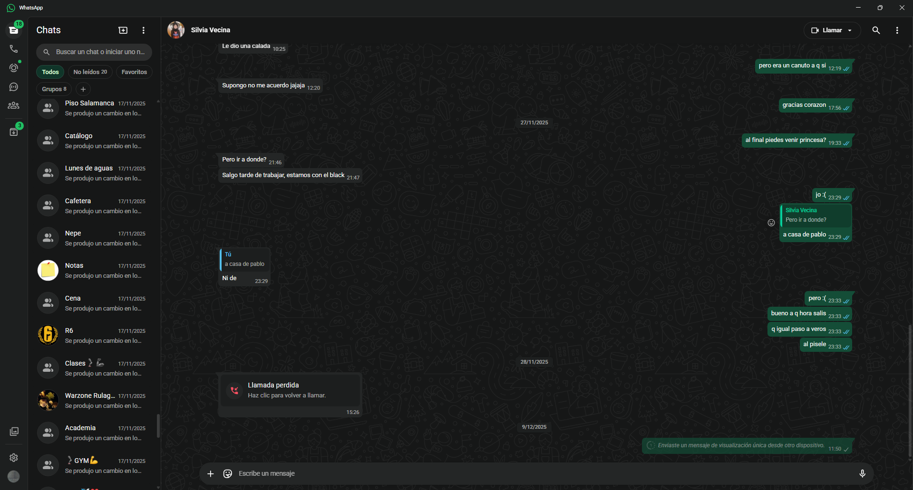  
	- Microsoft Teams  
		- Chat Individual  
			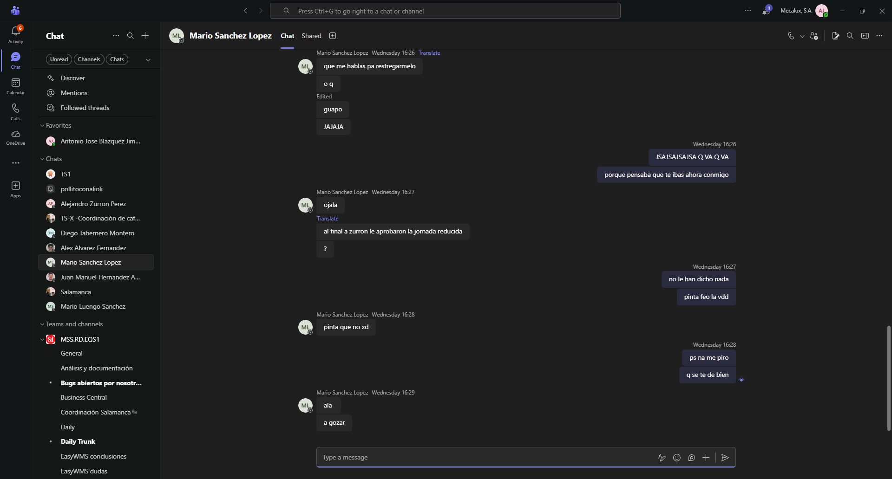  
		- Chat en Grupos  
			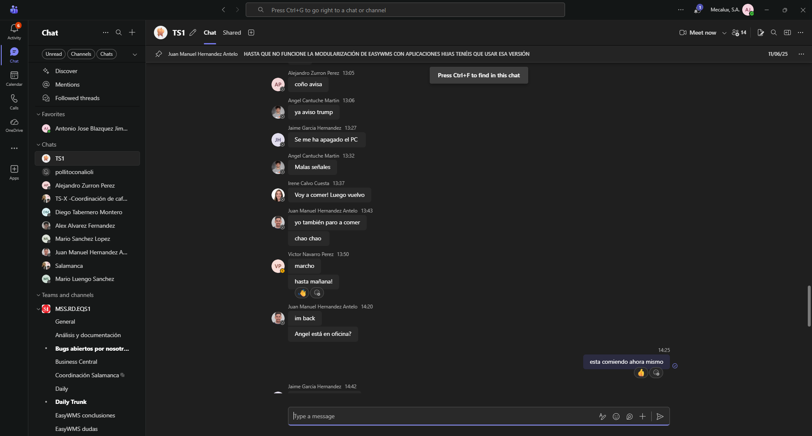  
		- Chat en Equipos  
			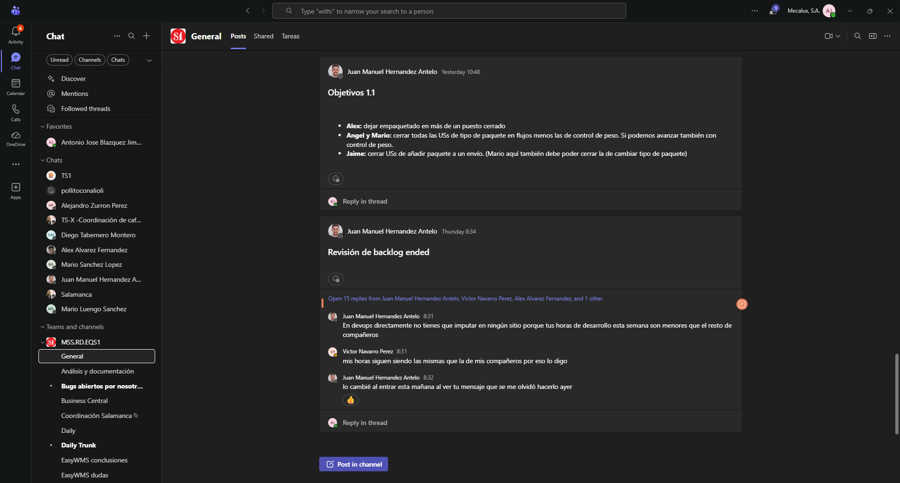  
	- Telegram  
		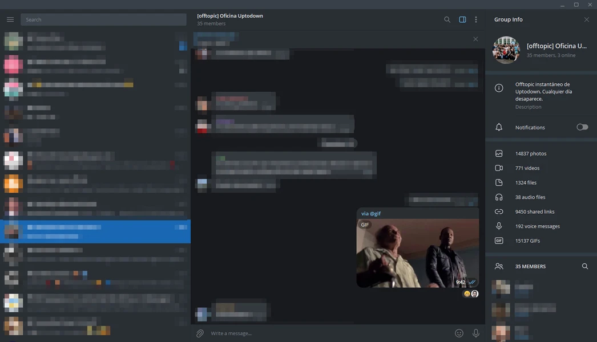  
	- Slack  
		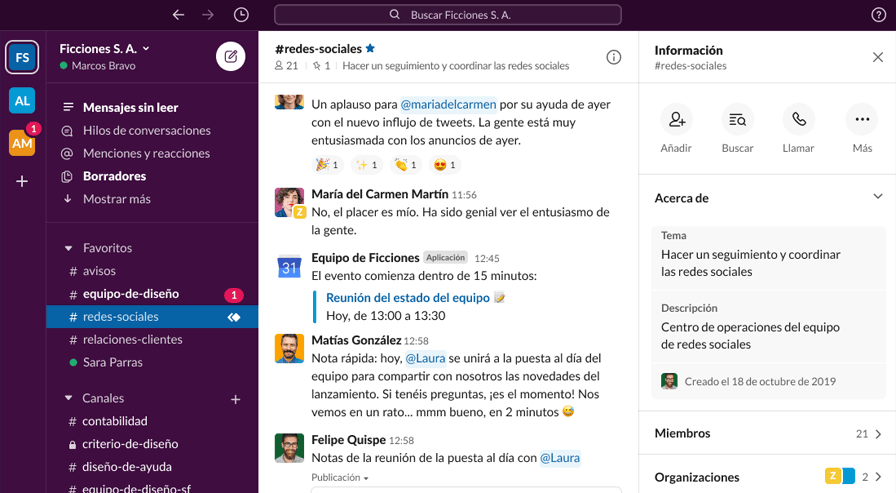  

## Análisis de Viabilidad  

1. **Análisis Técnico:**   
	EchoNow podrá desarrollarse dentro de los límites temporales establecidos, aunque para lograrlo será necesario ajustar el alcance inicial del proyecto, dado que se trata de una aplicación ambiciosa con múltiples funcionalidades.
	En particular, se ha decidido priorizar las funcionalidades esenciales y posponer otras de mayor complejidad técnica. Entre estas, se encuentra la eliminación del chat de voz integrado en toda la plataforma, así como la reducción de la infraestructura prevista mediante la eliminación de ciertos servidores inicialmente contemplados. Estas decisiones permiten simplificar el desarrollo, reducir la carga técnica y optimizar los tiempos de implementación.

	No obstante, la mayor parte de las funcionalidades principales sí podrán completarse dentro del tiempo previsto, garantizando una versión funcional y coherente del sistema.

	Las funcionalidades excluidas en esta fase formarán parte de una segunda versión de la aplicación, donde podrán desarrollarse con mayor profundidad y sin las limitaciones temporales actuales. Más adelante se detallarán las características técnicas del sistema, lo que permitirá entender mejor la planificación adoptada y la necesidad de esta división por fases.
1. **Análisis Económico:**    
	Al optar por una arquitectura simple y al utilizar un servidor Linux para la lógica de backend en Laravel y Vercel para el [framework](#glosario-de-términos-y-acrónimos) React se logra una infraestructura profesional con una inversión entre los **50€ y 90€**  *(Este valor puede variar según el progreso de la aplicación )*

## Herramientas y Tecnologías

Antes de empezar, me gustaría detallar que nuestra aplicación consistirá en un proyecto separado mediante dos repositorios: uno dedicado a la parte del **Backend** y otro repositorio para el **Frontend**.  

Esta separación nos permitirá trabajar de forma más organizada, escalable y profesional, siguiendo una arquitectura desacoplada que facilita el mantenimiento y la evolución del proyecto a largo plazo.  

---

**Backend – Laravel (v12)**  

Para la parte del servidor utilizaremos **Laravel 12**, que será el repositorio alojado en un servidor Linux.  
El servidor estará basado en **Ubuntu Server 22.04 LTS**, elegida por su **estabilidad, soporte a largo plazo (LTS)** y **seguridad**, lo que garantiza un entorno confiable para desplegar aplicaciones de producción.  
Ubuntu también ofrece amplia documentación y compatibilidad con herramientas modernas de desarrollo y despliegue de PHP, lo que facilita la gestión del servidor y el mantenimiento del proyecto a largo plazo.

Laravel es uno de los frameworks más utilizados del ecosistema PHP y ofrece múltiples ventajas:

- 🔐 **Seguridad integrada**: Protección contra ataques comunes como SQL Injection, XSS y CSRF.
- ⚡ **Desarrollo rápido**: Dispone de herramientas como Eloquent ORM, migraciones y sistema de autenticación preconfigurado.
- 🧩 **Arquitectura MVC**: Permite una clara separación de responsabilidades.
- 📈 **Escalabilidad**: Facilita la creación de APIs REST robustas que pueden crecer junto con el proyecto.
- 👥 **Gran comunidad y soporte**: Amplia documentación y recursos disponibles.

Trabajaremos con la versión estable más reciente (**Laravel 12**), garantizando soporte activo y acceso a las últimas mejoras del framework.

Gracias a estas características, Laravel nos permitirá desarrollar un backend sólido, mantenible y preparado para futuras ampliaciones.

---

**Frontend – React (v19)**  

Para la parte visual e interactiva utilizaremos JavaScript mediante **Node.js (LTS v24)** e introduciendo la librería **React 19**.

React es una de las librerías más populares para el desarrollo de interfaces modernas. Sus principales ventajas son:

- 🧱 **Arquitectura basada en componentes**: Permite reutilizar código y mantener una estructura organizada.
- 🚀 **Alto rendimiento**: Gracias al Virtual DOM, optimiza la actualización de la interfaz.
- 🔄 **Interactividad dinámica**: Ideal para aplicaciones web modernas tipo SPA (Single Page Application).
- 🌍 **Gran ecosistema**: Amplia compatibilidad con librerías externas.

Utilizaremos la versión estable más reciente (**React 19**) junto con una versión LTS de Node.js (**v24**), asegurando rendimiento y compatibilidad a largo plazo.

React nos permitirá construir una interfaz moderna, rápida y escalable, mejorando la experiencia del usuario.

---

**Estilos – Tailwind CSS (v4.2)**  

También utilizaremos el framework **Tailwind CSS 4.2** para el diseño visual.

- 📱 **Responsive por defecto**, facilitando el diseño adaptable a móviles y distintos dispositivos.
- 🧹 **Código más limpio**, evitando hojas de estilos excesivamente largas.
- ⚙️ **Alta personalización**, permitiendo adaptar el diseño a la identidad visual del proyecto.
- 🚀 **Mejor rendimiento en compilación**, gracias a las mejoras introducidas en la versión 4.

Trabajaremos con la versión estable más reciente (**v4.2**) para aprovechar sus optimizaciones y mejoras en productividad.

---

**Base de Datos – PostgreSQL (v18)**  

Como motor de base de datos utilizaremos **PostgreSQL 18**.

- 🛡️ **Alta fiabilidad y estabilidad**.
- 📊 **Soporte avanzado para consultas complejas**.
- 🔄 **Integridad y consistencia de datos**.
- 📈 **Escalabilidad y alto rendimiento**.
- ⚙️ **Mejoras continuas en optimización y replicación** en su versión más reciente.

PostgreSQL es una base de datos robusta y ampliamente utilizada en entornos profesionales, lo que garantiza seguridad y eficiencia en el manejo de la información. Utilizaremos la versión estable más reciente (**v18**) para asegurar soporte y rendimiento óptimo.

Para la mensajería instantánea deberemos de usar algún tipo de [WebSockets](#glosario-de-términos-y-acrónimos).   
Como nuestra aplicación estará divida en repositorio separados para una mejor organización deberemos hacer uso de estos WebSockets en los dos repositorios. He estado investigando cual puede ser la opción mas efectiva para mi desarrollo, ahora podemos separar las tecnologias en dos grandes apartados
1. **Backend**
	- Para Laravel se va a utilizar una dependencia llamada [beyondcode/laravel-websockets](https://beyondco.de/docs/laravel-websockets/getting-started/introduction), junto con la dependencia local de Laravel: [Laravel Echo](https://laravel.com/docs/12.x/broadcasting). Estas tecnologías se usan ya que suelen estar muy bien integrados con Laravel, soporta canales privados y presencia y no hace falta pagar Pusher. 
2. **Frontend**
	- En React se consumirán los WebSockets con la dependencia creada por Laravel para JavaScript [Laravel-echo](https://github.com/laravel/echo/tree/2.x/packages/laravel-echo), además tambien deberemos de hacer uso de la dependencia [pusher.js](https://github.com/pusher/pusher-js). Esto mejorará la experiencia al usuario gracias a la rapidez que tiene.

Además utilizaremos algunas herramientas como por ejemplo:  
- **GitHub Actions:**   
	Lo utilizaremos para la ejecución de tareas relacionadas con la gestión del repositorio, como cambios en ramas, _pull requests_, _issues_ y distintos procesos de automatización.  
	   
	En una primera fase, se aplicará al Frontend, donde se realizará la compilación de los archivos y la optimización de la aplicación para garantizar su correcta subida a producción.

	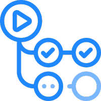 

- **Bruno:**   
	Es una aplicación para consumir [APIs](#glosario-de-términos-y-acrónimos) en vez de utilizar Postman me he decantado por esta opción ya que es de código abierto a diferencia de Postman.   

	

- **TablePlus**:   
	Es un interfaz para la gestión de los datos de la base de datos, también he querido usar este gestor ya que es uno de los más rápidos que existen  

	

- **Github Projects:**   
	Lo uso para programarme las tareas que debo de seguir y tener un mayor  control de la aplicación, aquí tendré un proyecto para cada repositorio, para poder separar las tareas correctamente

	
Además de estas herramientas básicas que he nombrado también debemos de tener claro que tanto para el *frontend* como para el *backend* usaremos dependencias para un mejor funcionamiento.   

---  

# Definición del Sistema

Las funcionalidades definen las acciones y capacidades específicas que el sistema debe ejecutar para satisfacer las necesidades del usuario.  

## Objetivos del Proyecto  
 
- ### Objetivo General  

El objetivo general se podría generalizar en **5** grandes módulos

| Concepto                          | Descripción                                                                            | Análisis                                                                                                                                                                                                                                                                                                                                                                                    |
| --------------------------------- | -------------------------------------------------------------------------------------- | ------------------------------------------------------------------------------------------------------------------------------------------------------------------------------------------------------------------------------------------------------------------------------------------------------------------------------------------------------------------------------------------- |
| **Mensajería en Tiempo Real**     | Sistema de chat instantáneo para usuarios, grupos y canales con persistencia de datos. | **S:** Chat de texto persistente. **M:** Latencia de entrega de mensajes inferior a 500 ms y disponibilidad del servidor del 99.9%. **A:** Se puede implementar con Laravel 12, Node.js v24 y PostgreSQL 18. **R:** Es la funcionalidad principal de la aplicación y el núcleo de interacción entre usuarios. **T:** Implementación en semanas 2-6 del proyecto.                |
| **Infraestructura y Despliegue**  | Puesta en marcha del ecosistema en servidores reales para acceso público.              | **S:** Despliegue de Backend y Frontend. **M:** Disponibilidad mínima del 99%. **A:** Alcanzable utilizando Ubuntu Server 22.04 LTS y servicios cloud dentro del presupuesto estimado. **R:** Permite que la aplicación sea accesible públicamente y garantiza su funcionamiento en entorno real. **T:** Implementación en semanas 6-8.                                         |
| **Gestión de Servidores y Roles** | Estructura jerárquica para comunidades con permisos de administración específicos.     | **S:** Sistema de permisos funcional. **M:** Control de acceso por canal y validación de roles en base de datos. **A:** Implementable con el sistema de autorización de Laravel 12. **R:** Garantiza la seguridad, organización y control dentro de las comunidades creadas. **T:** Desarrollo en semanas 8-10.                                                                 |
| **Comunicación (VoIP)**           | Capacidad de realizar llamadas de voz entre usuarios o dentro de servidores.           | **S:** Audio bidireccional estable. **M:** Estabilidad en llamadas con pérdida de paquetes inferior al 2% y latencia menor a 150 ms en red estable. **A:** Posible mediante WebRTC integrado con React y Node.js. **R:** Amplía la funcionalidad de comunicación más allá del texto, aumentando el valor competitivo de la aplicación. **T:** Implementación en semanas 10-1 2. |
| **Diseño de la Interfaz**         | Diseño limpio, intuitivo y enfocado en la productividad sin saturación visual.         | **S:** Interfaz responsiva con TailwindCSS. **M:** Puntuación mínima de 90 en Google Lighthouse y diseño adaptable a móviles. **A:** Alcanzable mediante React y TailwindCSS con desarrollo basado en componentes. **R:** Mejora la experiencia de usuario y facilita la adopción de la aplicación. **T:** Desarrollo continuo durante todo el proyecto (semanas 1-14).         |
 
  
- ### Objetivos Funcionales
  
Los  Objetivos funcionales se distribuirán de la siguiente manera:  

| ID        | MODULO                                                     | Descripción                                                                   | SMART                                                                                                                                                                                                                                                                                                                                                                                  | Prioridad |
| --------- | ---------------------------------------------------------- | ----------------------------------------------------------------------------- | -------------------------------------------------------------------------------------------------------------------------------------------------------------------------------------------------------------------------------------------------------------------------------------------------------------------------------------------------------------------------------------- | --------- |
| **OBJ01** | **Registro y Acceso**                                      | Sistema de autenticación de usuarios para permitir el uso de la aplicación.   | **S:** Acceso con usuario/clave. **M:** Validación correcta de credenciales en base de datos con tasa de error inferior al 1%. **A:** Laravel 12 proporciona sistemas de autenticación listos para usar. **R:** Es imprescindible para garantizar seguridad y control de acceso a la aplicación. **T:** Implementación en la semana 1.                                     | Alta      |
| **OBJ02** | **Mensajería**                                             | Chat de texto privado entre dos usuarios con visualización instantánea.       | **S:** Envío y recepción de mensajes en tiempo real. **M:** Latencia inferior a 1 s con RTT optimizado y disponibilidad del 99.9%. **A:** Implementable con Laravel 12, Node.js v24 y WebSockets con persistencia en PostgreSQL 18. **R:** Constituye la funcionalidad principal y núcleo de la aplicación. **T:** Desarrollo en semanas 2-4.                              | Alta      |
| **OBJ03** | **Servidores Públicos**                                    | Espacios accesibles mediante URL o invitación con múltiples canales.          | **S:** Creación de servidores con canales independientes. **M:** Soporte para al menos 50 canales por servidor sin degradación de rendimiento. **A:** Posible con gestión estructurada en Laravel y PostgreSQL y renderizado dinámico en React. **R:** Permite escalar la aplicación y fomentar comunidades organizadas. **T:** Desarrollo en semanas 6-8.                 | Alta      |
| **OBJ04** | **Interfaz**                                               | Panel de navegación intuitivo                                                 | **S:** Interfaz desarrollada con React y TailwindCSS. **M:** Puntuación mínima de 90 en Google Lighthouse y diseño 100% responsive. **A:** Alcanzable mediante arquitectura basada en componentes reutilizables. **R:** Mejora la experiencia de usuario y favorece la adopción de la plataforma. **T:** Desarrollo continuo durante semanas 1-12.                         | Alta      |
| **OBJ05** | **Roles en servidores**                                    | Asignación de permisos jerárquicos a usuarios dentro de los servidores.       | **S:** Sistema de roles y permisos jerárquicos. **M:** Definición de al menos 3 niveles jerárquicos funcionales con validación automática de permisos. **A:** Implementable mediante el sistema de autorización de Laravel 12. **R:** Garantiza la seguridad y organización interna de cada servidor. **T:** Desarrollo en semanas 8-10.                                   | Media     |
| **OBJ06** | **Comunicación [VoIP](#glosario-de-términos-y-acrónimos)** | Implementación de llamadas de voz entre usuarios y en canales de servidor.    | **S:** Comunicación de audio bidireccional en tiempo real. **M:** Latencia menor a 150 ms y pérdida de paquetes inferior al 2% en red estable. **A:** Implementable con WebRTC integrado en React y soporte de señalización en Node.js. **R:** Amplía las capacidades de comunicación y aumenta el valor competitivo de la aplicación. **T:** Desarrollo en semanas 10-12. | Media     |
| **OBJ07** | **Gestión de Grupos**                                      | Creación de salas de chat cerradas con un administrador y lista de invitados. | **S:** Creación y administración de grupos privados. **M:** Soporte para al menos 100 usuarios por grupo con 1 administrador activo. **A:** Alcanzable con gestión de relaciones en PostgreSQL y control de permisos en Laravel. **R:** Facilita la organización de conversaciones privadas dentro de la plataforma. **T:** Desarrollo en semanas 4-6.                     | Media     |
| **OBJ08** | **Implementación [IA](#glosario-de-términos-y-acrónimos)** | Conexión a una Inteligencia Artificial externa                                | **S:** Integración mediante API externa. **M:** Respuesta de la API inferior a 2 segundos en condiciones normales. **A:** Posible mediante consumo de APIs REST seguras con Laravel y Node.js. **R:** Añade funcionalidades avanzadas y valor diferencial al proyecto. **T:** Implementación en semanas 12 hasta fin de proyecto.                                          | Baja      |

---
## Definiciones de Actores  

En esta sección se identifican y describen los distintos actores que interactúan con el sistema. Un actor representa cualquier entidad que participa en el uso de la aplicación, ya sea un usuario humano o un sistema externo que intercambia información con la plataforma.  

**Casos de uso**

| ID    | ACTOR                     | CARGO                                                                                                                                                  |
| ----- | ------------------------- | ------------------------------------------------------------------------------------------------------------------------------------------------------ |
| ACT01 | Usuario no registrado     | Persona que accede a la aplicación sin haber iniciado sesión o sin poseer una cuenta registrada en el sistema.                                         |
| ACT02 | Usuario registrado        | Usuario que posee una cuenta válida dentro de la plataforma y puede utilizar las funcionalidades principales de comunicación.                          |
| ACT03 | Administrador de servidor | Usuario con permisos avanzados dentro de un servidor específico. Generalmente es el creador del servidor o un usuario con privilegios administrativos. |
| ACT04 | Administrador del sistema | Usuario encargado de la gestión global de la plataforma y del mantenimiento del sistema.                                                               |

**Servicios adicionales**

| ACT05 | Servicio de autenticación             | Servicio encargado de validar la identidad de los usuarios dentro de la aplicación.                    |
| ----- | ------------------------------------- | ------------------------------------------------------------------------------------------------------ |
| ACT06 | Servicio de mensajería en tiempo real | Servicio encargado de gestionar el intercambio de mensajes instantáneos entre los usuarios de EchoNow. |
| ACT07 | Servicio VoIP                         | Sistema responsable de gestionar las llamadas de voz entre usuarios dentro de la plataforma.           |

---
## Especificación Funcional  
### Diagrama de Casos de Uso 

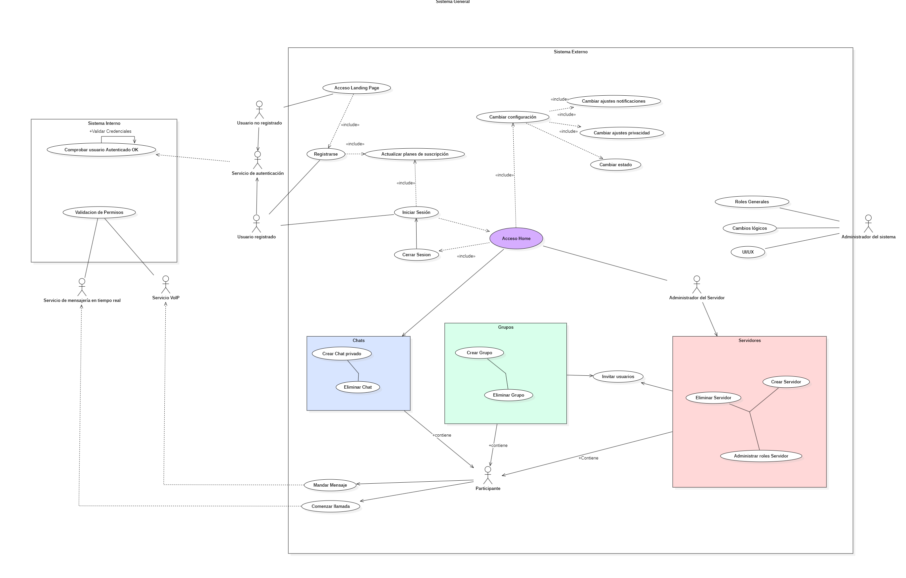

### Tablas de especificación de Casos de Uso

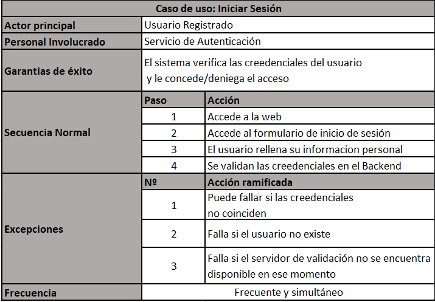

---

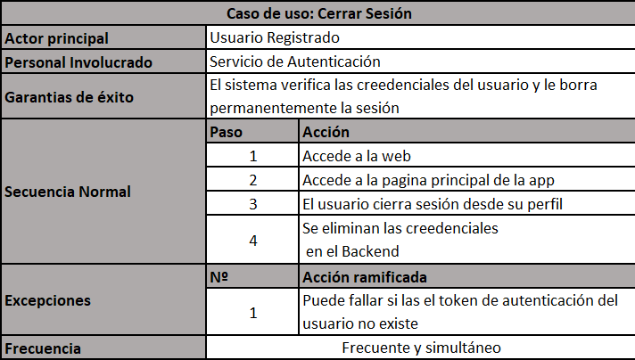

---

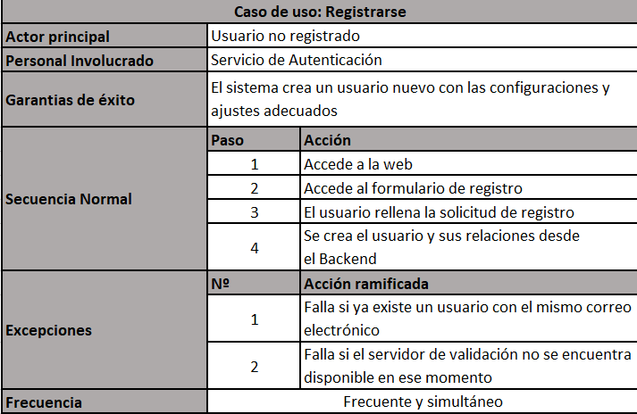

---

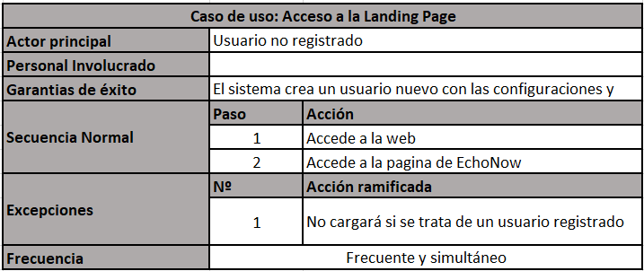

---

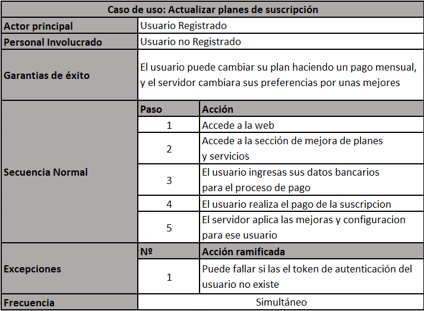

---

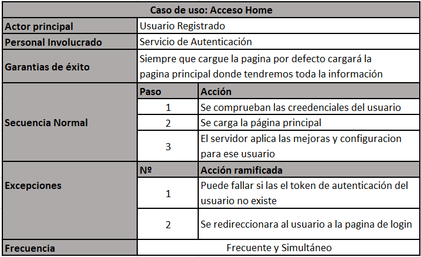

---

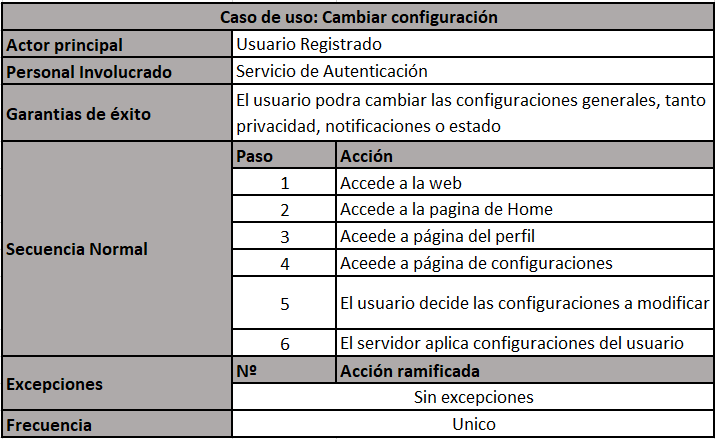

---

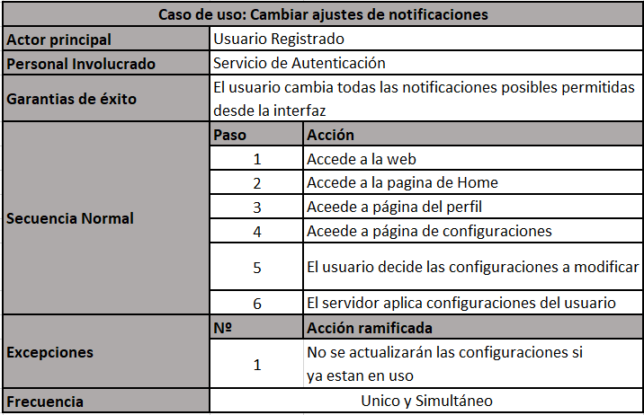

---

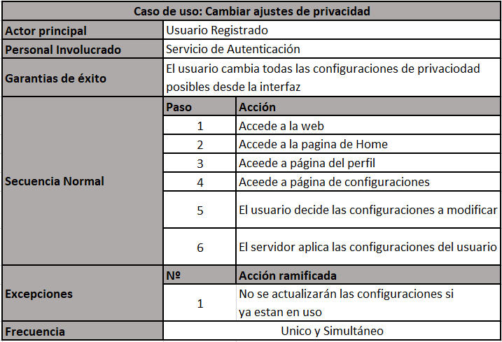

---

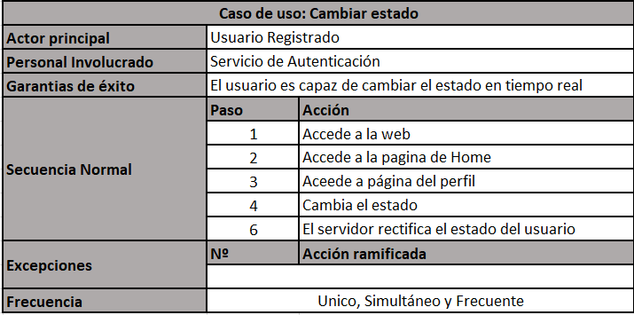

---

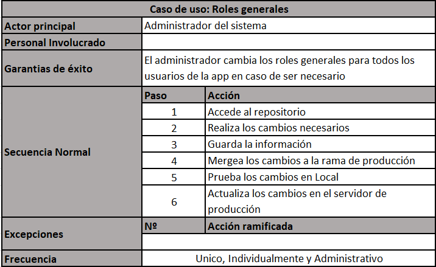

---

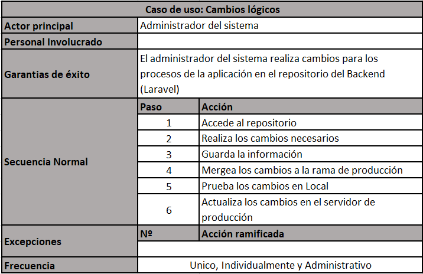

---

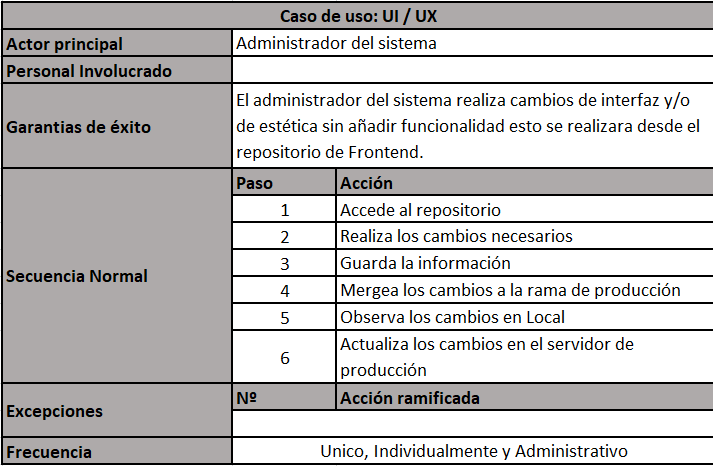

---

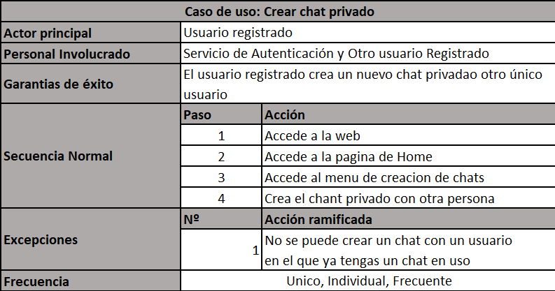

---

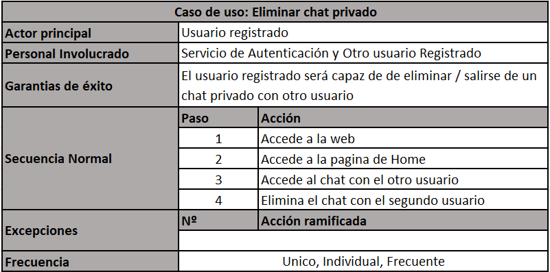

---

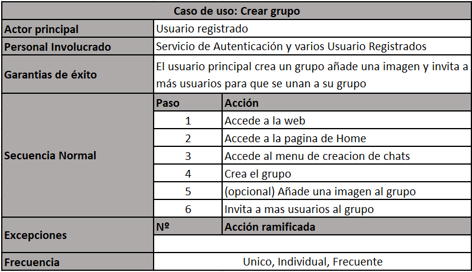

---

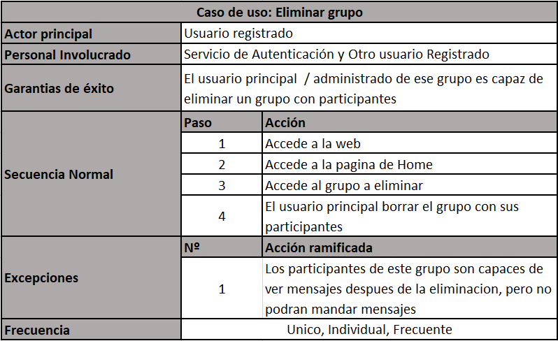

---

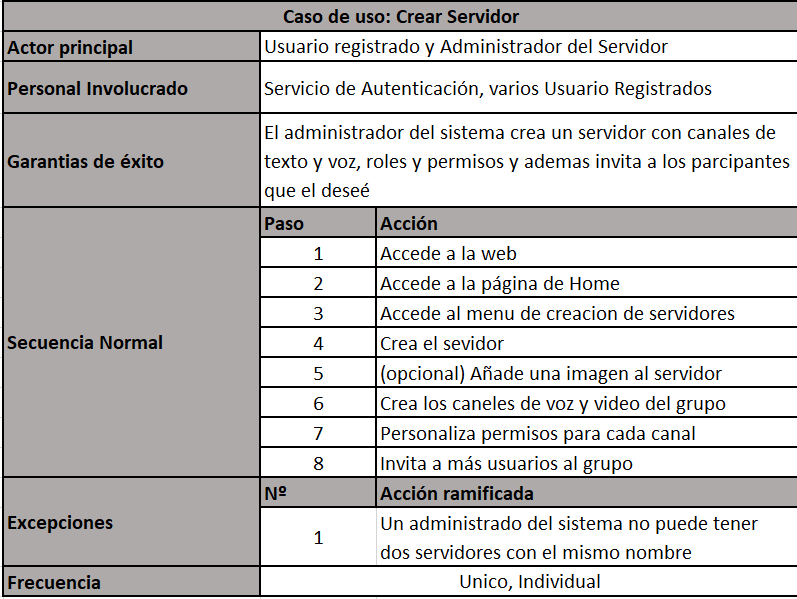

---

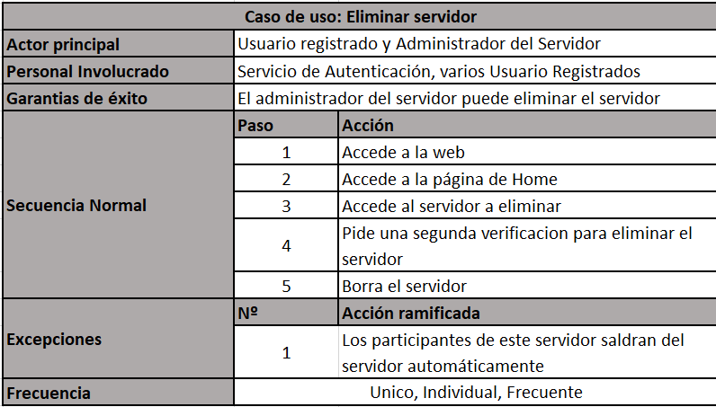

---

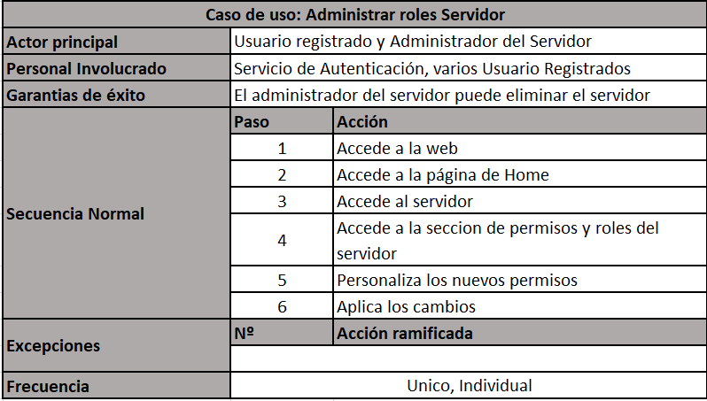

---

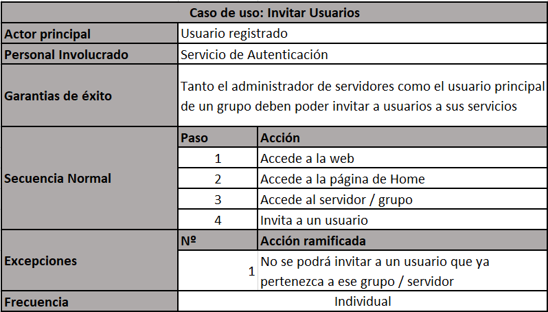

---

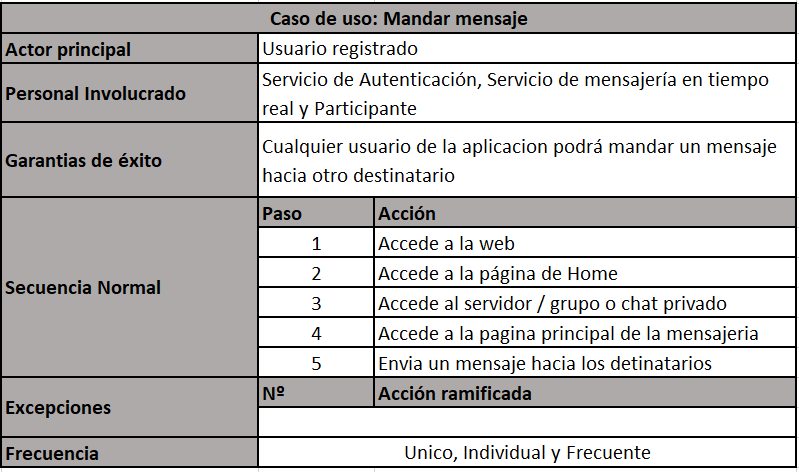

---

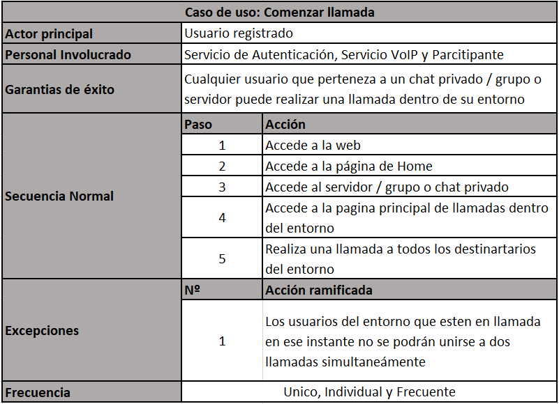

---
## Requisitos del Sistema (SRS)

### Requisitos Funcionales (RF)  

| ID   | Nombre corto               | Descripción detallada                                                                                                                                                          | Actor        | Prioridad |
| ---- | -------------------------- | ------------------------------------------------------------------------------------------------------------------------------------------------------------------------------ | ------------ | --------- |
| RF01 | Registro de usuario        | El sistema permite crear una cuenta nueva con nombre de usuario, correo electrónico y contraseña. Las contraseñas se almacenan cifradas mediante hash.                         | ACT01        | Alta      |
| RF02 | Inicio de sesión           | El sistema valida las credenciales del usuario (correo + contraseña) y otorga acceso a la aplicación generando un token de sesión (JWT).                                       | ACT02        | Alta      |
| RF03 | Cierre de sesión           | El sistema permite al usuario cerrar su sesión activa, invalidando el token y redirigiendo a la pantalla de inicio.                                                            | ACT02        | Alta      |
| RF04 | Acceso a landing page      | El sistema muestra una página pública accesible sin autenticación con información del producto, planes y botones de acción.                                                    | ACT01        | Alta      |
| RF05 | Acceso a home              | Tras autenticarse, el sistema redirige al usuario al panel principal donde puede ver sus conversaciones, grupos y servidores disponibles.                                      | ACT02        | Alta      |
| RF06 | Cambiar configuración      | El sistema permite al usuario modificar sus preferencias generales de cuenta: nombre de usuario, avatar y datos de perfil.                                                     | ACT02        | Media     |
| RF07 | Configurar notificaciones  | El sistema permite al usuario activar o desactivar notificaciones por tipo de evento (mensaje, mención, llamada).                                                              | ACT02        | Media     |
| RF08 | Configurar privacidad      | El sistema permite al usuario gestionar quién puede enviarle mensajes directos o invitarle a grupos y servidores.                                                              | ACT02        | Media     |
| RF09 | Cambiar estado             | El sistema permite al usuario cambiar su estado de presencia (disponible, ocupado, ausente, invisible).                                                                        | ACT02        | Baja      |
| RF10 | Crear chat privado         | El sistema permite al usuario registrado iniciar una conversación de texto directa con otro usuario de la plataforma.                                                          | ACT02        | Alta      |
| RF11 | Eliminar chat privado      | El sistema permite al usuario eliminar una conversación privada. Los mensajes se borran únicamente del lado del usuario que elimina.                                           | ACT02        | Media     |
| RF12 | Enviar mensaje             | El sistema transmite mensajes de texto en tiempo real (latencia < 500 ms) entre los participantes del canal o conversación activa, persistiendo el contenido en base de datos. | ACT02, ACT06 | Alta      |
| RF13 | Crear grupo                | El sistema permite al usuario crear un grupo privado, definir su nombre y añadir participantes mediante invitación directa.                                                    | ACT02        | Media     |
| RF14 | Eliminar grupo             | El sistema permite al administrador del grupo disolver el grupo, eliminando el canal y todos sus mensajes asociados.                                                           | ACT02, ACT03 | Media     |
| RF15 | Crear servidor             | El sistema permite al usuario crear un servidor público con nombre e imagen, generando automáticamente un enlace URL de invitación.                                            | ACT02        | Alta      |
| RF16 | Eliminar servidor          | El sistema permite al administrador del servidor eliminarlo junto con todos sus canales, mensajes y configuraciones asociadas.                                                 | ACT03        | Media     |
| RF17 | Administrar roles          | El sistema permite al administrador del servidor crear roles, asignar permisos específicos por rol y asignarlos a usuarios del servidor.                                       | ACT03        | Media     |
| RF18 | Invitar usuarios           | El sistema permite al administrador invitar a usuarios a un grupo o servidor mediante enlace URL o invitación directa.                                                         | ACT02, ACT03 | Alta      |
| RF19 | Comenzar llamada VoIP      | El sistema establece una llamada de voz bidireccional en tiempo real entre usuarios (latencia < 150 ms, pérdida de paquetes < 2%) usando WebRTC.                               | ACT02, ACT07 | Media     |
| RF20 | Gestión de roles generales | El sistema distingue entre roles globales de la plataforma (usuario estándar, administrador del sistema) y aplica restricciones de acceso en consecuencia.                     | ACT04        | Media     |
| RF21 | Actualizar planes          | El sistema permite al usuario visualizar y contratar planes de pago desde la sección de configuración o landing page, aplicando las funciones asociadas al plan contratado.    | ACT02        | Baja      |
| RF22 | Diseño UI/UX responsivo    | El sistema renderiza correctamente la interfaz en dispositivos móviles y escritorio, alcanzando una puntuación mínima de 90 en Google Lighthouse y cumpliendo nivel AA WCAG.   | ACT02        | Alta      |

---

### Requisitos No Funcionales (RNF)  

| ID    | Nombre corto                       | Descripción detallada                                                                                                                                                                        | Prioridad |
| ----- | ---------------------------------- | -------------------------------------------------------------------------------------------------------------------------------------------------------------------------------------------- | --------- |
| RNF01 | Latencia de mensajes               | El sistema debe entregar los mensajes de texto en tiempo real con una latencia inferior a 500 ms medida por RTT entre cliente y servidor en condiciones de red estable.                      | Alta      |
| RNF02 | Latencia VoIP                      | Las llamadas de voz deben mantener una latencia inferior a 150 ms y una pérdida de paquetes inferior al 2% en condiciones de red estable.                                                    | Alta      |
| RNF03 | Disponibilidad del servidor        | El sistema backend debe garantizar una disponibilidad mínima del 99,9%, minimizando el tiempo de inactividad no planificado.                                                                 | Alta      |
| RNF04 | Cifrado de contraseñas             | Todas las contraseñas de usuario deben almacenarse cifradas mediante algoritmos de hash seguros (bcrypt). Nunca se almacenarán en texto plano.                                               | Alta      |
| RNF05 | Autenticación con JWT              | El sistema debe usar tokens JWT para gestionar las sesiones de usuario, garantizando que cada petición autenticada incluya un token válido y firmado.                                        | Alta      |
| RNF06 | Diseño responsive                  | La interfaz debe adaptarse correctamente a los breakpoints xl, lg, md y sm definidos en Tailwind CSS, siendo funcional en dispositivos móviles y de escritorio.                              | Alta      |
| RNF07 | Arquitectura desacoplada           | El sistema debe mantener una separación estricta entre frontend (React) y backend (Laravel), comunicándose únicamente mediante API REST y WebSockets, sin dependencias directas entre capas. | Alta      |
| RNF08 | Patrón MVC en backend              | El código del backend debe organizarse siguiendo el patrón MVC de Laravel, separando modelos, controladores y lógica de negocio en servicios independientes.                                 | Media     |
| RNF09 | Integridad y consistencia de datos | La base de datos PostgreSQL debe garantizar la integridad referencial mediante claves primarias y foráneas, y el ORM Eloquent debe gestionar todas las operaciones de persistencia.          | Alta      |
| RNF10 | Tiempo de respuesta API            | Las peticiones a la API REST deben resolverse en menos de 2 segundos en condiciones normales de uso, incluyendo las llamadas a servicios externos como la API de IA.                         | Media     |
| RNF11 | Entorno de despliegue estable      | El backend debe desplegarse sobre Ubuntu Server 22.04 LTS, garantizando estabilidad, soporte a largo plazo y compatibilidad con las herramientas del stack tecnológico.                      | Media     |

# Requisitos de Información (IRQ)

| ID    | Nombre corto          | Descripción detallada                                                                                 | Tipo de dato | Entidad  | Prioridad |
| ----- | --------------------- | ----------------------------------------------------------------------------------------------------- | ------------ | -------- | --------- |
| IRQ01 | Correo electrónico    | Dirección de email única usada para autenticación y comunicaciones del sistema.                       | VARCHAR(255) | Usuario  | Alta      |
| IRQ02 | Contraseña cifrada    | Hash de la contraseña del usuario generado con bcrypt. Nunca se almacena en texto plano.              | VARCHAR(255) | Usuario  | Alta      |
| IRQ03 | Contenido del mensaje | Texto del mensaje enviado por el usuario en una conversación, canal o grupo.                          | TEXT         | Mensaje  | Alta      |
| IRQ04 | Enlace de invitación  | URL única autogenerada que permite a nuevos usuarios unirse al servidor.                              | VARCHAR(255) | Servidor | Alta      |
| IRQ05 | Token de sesión       | JWT generado en el inicio de sesión, almacenado en el cliente para autenticar peticiones posteriores. | TEXT         | Sistema  | Alta      |

---

### Diagrama de Gantt

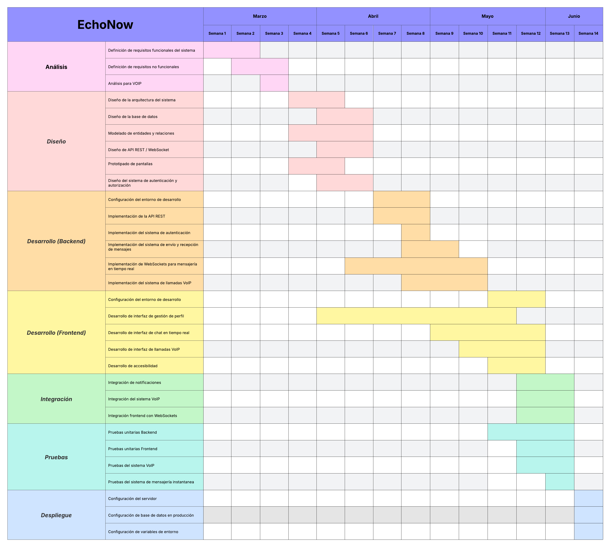

**Tabla resumen**

| Fase | Actividad | Duración (semanas) |
|------|----------|-------------------|
| **Análisis** | Requisitos funcionales | 2 |
| | Requisitos no funcionales | 2 |
| | Análisis VoIP | 1 |
| **Diseño** | Arquitectura del sistema | 2 |
| | Base de datos | 2 |
| | Modelo entidad-relación | 2 |
| | API REST / WebSocket | 2 |
| | Prototipado | 2 |
| | Autenticación | 2 |
| **Backend** | Entorno de desarrollo | 2 |
| | API REST | 2 |
| | Autenticación | 1 |
| | Mensajería | 2 |
| | WebSockets | 3 |
| | Sistema VoIP | 3 |
| **Frontend** | Entorno | 2 |
| | Perfil usuario | 5 |
| | Chat en tiempo real | 3 |
| | Llamadas VoIP | 2 |
| | Accesibilidad | 2 |
| **Integración** | Notificaciones | 2 |
| | Sistema VoIP | 2 |
| | Frontend + WebSockets | 2 |
| **Pruebas** | Backend | 2 |
| | Frontend | 2 |
| | VoIP | 2 |
| | Mensajería | 1 |
| **Despliegue** | Servidor | 1 |
| | Base de datos prod | 1 |
| | Variables de entorno | 1 |

---

## Normativa y Legislación

El desarrollo y funcionamiento de **EchoNow** debe cumplir con distintas normativas legales relacionadas con la protección de datos, comercio electrónico, accesibilidad web y uso de software de terceros. A continuación se detallan las principales regulaciones aplicables al proyecto.

---

### RGPD y LOPDGDD (Protección de Datos)

La aplicación EchoNow gestiona información personal de los usuarios para poder ofrecer sus servicios de comunicación.

**Datos de registro**  
- Nombre de usuario
- Dirección de correo electrónico
- Contraseña cifrada (hash)

**Datos técnicos**  
- Fecha y hora de registro
- Registros de acceso (logs de seguridad)

**Datos generados por el uso del sistema**  
- Mensajes enviados en conversaciones
- Identificadores de servidores, grupos y canales
- Metadatos de comunicaciones

Las contraseñas nunca se almacenan en texto plano, sino mediante algoritmos de cifrado seguros proporcionados por el sistema de autenticación de Laravel.  

**Ubicación de la base de datos**

La base de datos PostgreSQL del sistema se alojará en un servidor Linux de manera local en el contexto de desarrollo y en un servidor de Linux cuando se encuentre en un entorno de producción.  

Además si la velocidad de conexión nos lo permite podremos hacer una copia de seguridad en un servicio externo llamado [Supabase](https://supabase.com/) que almacena los datos de nuestra organización en un servidor configurado en la región de EU.   

**Derecho al olvido y eliminación de datos**  

Los usuarios podrán ejercer sus derechos de protección de datos:

- Derecho de acceso
- Derecho de rectificación
- Derecho de supresión (**derecho al olvido**)
- Derecho de limitación del tratamiento

Para solicitar la eliminación de datos, el usuario podrá:

1. Solicitar la eliminación desde la configuración de su cuenta.
2. Contactar con el administrador del sistema mediante correo electrónico (echonow@support.com).  

**Política de Cookies**  

EchoNow utilizará únicamente el almacenamiento interno del navegador para guardar las credenciales del usuario.

- Mantener la sesión de usuario iniciada.
- Gestionar autenticación segura.

En un principio no se utilizarán cookies de terceros ni cookies publicitarias.

---

### LSSI-CE (Comercio Electrónico)

**Transparencia en servicios**

- Los precios estén claramente indicados.
- Se especifiquen los impuestos aplicables.
- Se indiquen las condiciones de contratación.
- Se informe del proceso de compra antes de realizar el pago.

Esta condición es especifica únicamente para la mejora de planes si el usuario final lo decide.  

**Aviso Legal**  

La página web o aplicación incluirá una sección de *Aviso Legal* visible donde se indiquen los datos del responsable del proyecto:

- Nombre del responsable
- Dirección de contacto
- Correo electrónico de contacto
- Información sobre el uso de la plataforma  

---

### Accesibilidad Web (WCAG)

**Nivel de conformidad**  

El objetivo del proyecto será cumplir con el *Nivel AA*.

**Medidas de accesibilidad implementadas**  

1. Contraste de colores
	- Se garantizará un contraste suficiente entre texto y fondo para facilitar la lectura.
2. Texto alternativo en imágenes
	- Todas las imágenes incluirán atributos *alt*.
3. Navegación mediante teclado
	- Todos los elementos interactivos serán accesibles mediante teclado mediante la tecla *tab*.
4. Diseño *Responsive*
	- La interfaz será adaptable a diferentes tamaños de pantalla (*xl, lg, md, sm*) mediante estilos Tailwind.  

---

### Licencias de Software

**Tecnologías principales**  

| Tecnología   | Tipo                 | Licencia           |
| ------------ | -------------------- | ------------------ |
| Laravel      | Framework backend    | MIT                |
| React        | Librería frontend    | MIT                |
| Node.js      | Entorno de ejecución | MIT                |
| Tailwind CSS | Framework de estilos | MIT                |
| PostgreSQL   | Base de datos        | PostgreSQL License |

**Librerías adicionales (Backend)**

| Librería                      | Uso                                                                     | Licencia |
| ----------------------------- | ----------------------------------------------------------------------- | -------- |
| laravel/echo                  | Laravel Echo library for beautiful Reverb, Pusher, and Ably integration | MIT      |
| beyondcode/laravel-websockets | Websockets for Laravel. Done right                                      | MIT      |
| reliese/laravel               | Reliese Laravel Model Generator                                         | MIT      |
| tymon/jwt-auth                | JSON Web Token Authentication for Laravel & Lumen                       | MIT      |
| laravel/fortify               | Backend controllers and scaffolding for Laravel authentication          | MIT      |
| laravel/sanctum               | Backend controllers and scaffolding for Laravel authentication          | MIT      |

**Librerías adicionales (Frontend)**

| Librería              | Uso                                                                | Licencia           |
| --------------------- | ------------------------------------------------------------------ | ------------------ |
| pusher-js             | Cliente para comunicación bidireccional                            | MIT                |
| lineicons             | Set de iconos optimizados para interfaces web.                     | (MIT/Custom)       |
| use-sound             | Hook de React para reproducir efectos de sonido.                   | MIT                |
| fontsource/space-mono | Fuente autoalojada (Space Mono) para mejorar el rendimiento.       | Open Font License |
| axios                 | Cliente HTTP basado en promesas para realizar peticiones a la API. | MIT                |

# Diseño Tecnológico y Arquitectura  

En esta fase transformamos los requisitos definidos en el entregable anterior en una solución técnica estructurada. Se define el cómo se construye el sistema mediante modelado, arquitectura y diseño visual. 

---
## Arquitectura del Software  

El proyecto EchoNow presenta una arquitectura bien estructurada y desacoplada, donde se separan claramente las responsabilidades entre frontend (React) para la interfaz de usuario, backend (Laravel) para la lógica de negocio y PostgreSQL para la persistencia de datos.  
La lógica del sistema se gestiona de forma centralizada en el backend, garantizando seguridad, escalabilidad y mantenibilidad, mientras que la comunicación se realiza mediante API REST (JSON) y WebSockets para tiempo real.  
Además, toda la aplicación backend está organizada siguiendo el patrón MVC (Modelo-Vista-Controlador), lo que permite dividir correctamente la gestión de datos, la lógica y la presentación, evitando el acoplamiento del código y facilitando su evolución futura.  

-  **📂 DIVISIÓN DE RESPONSABILIDADES**  
  
El sistema EchoNow presenta una clara separación de responsabilidades, lo que permite evitar el acoplamiento entre sus distintas partes y facilita la escalabilidad y el mantenimiento del proyecto. Esta separación se basa en una arquitectura desacoplada dividida en tres capas principales.  
Por un lado, el frontend, desarrollado con React, se encarga exclusivamente de la interfaz de usuario (UI) y de la interacción con el usuario. Por otro lado, el backend, implementado con Laravel, gestiona el procesamiento de datos, la lógica del sistema y la exposición de servicios. Finalmente, la base de datos PostgreSQL se encarga del almacenamiento persistente de la información.  
Además, el uso del patrón MVC en Laravel refuerza esta separación. Diferenciando entre modelos (datos), vistas (representación) y controladores (gestión de la lógica). Esta estructura permite una organización clara del código y evita dependencias innecesarias entre componentes.  

- **🧠 LÓGICA DE NEGOCIO**  
  
La lógica de negocio de la aplicación se encuentra centralizada en el backend, concretamente en el framework Laravel. Esto garantiza que todas las reglas del sistema se gestionen de forma coherente y segura, evitando que el frontend asuma responsabilidades que no le corresponden.  
Dentro del backend, la lógica se implementa principalmente en los controladores, modelos y servicios de Laravel. Aquí se definen aspectos clave como la autenticación de usuarios, la gestión de permisos mediante roles, la creación y administración de servidores, grupos y canales, así como el envío y recepción de mensajes.  
Asimismo, Laravel proporciona herramientas integradas para la validación de datos y la seguridad, lo que permite aplicar reglas de negocio como el control de acceso, la verificación de credenciales o la integridad de la información. De este modo, el sistema mantiene un comportamiento consistente y fiable.  

- **💾 PERSISTENCIA DATOS**  
    
La persistencia de datos en EchoNow se gestiona mediante una base de datos relacional PostgreSQL, que garantiza un almacenamiento robusto, consistente y escalable. El acceso a los datos se realiza a través del ORM Eloquent de Laravel, lo que facilita la interacción con la base de datos mediante modelos y relaciones bien definidas.  
En la base de datos se almacenan distintos tipos de información, como los datos de usuario (correo electrónico, contraseña cifrada), mensajes, servidores, canales, roles y registros de actividad. Todo ello se gestiona siguiendo principios de integridad y consistencia de datos.  
En cuanto a la seguridad, las contraseñas se almacenan utilizando técnicas de cifrado hash, evitando su almacenamiento en texto plano.  

- **🌐 INTERFAZ DE COMUNICACIÓN**  
  
La comunicación entre el frontend y el backend se realiza mediante una interfaz basada en APIs REST y WebSockets, lo que permite combinar operaciones tradicionales con comunicación en tiempo real.  
Por un lado, la API REST utiliza el protocolo HTTP y el formato JSON para el intercambio de datos. Esta se emplea en operaciones como el registro e inicio de sesión de usuarios, la gestión de recursos (usuarios, servidores, mensajes) y la configuración del sistema.  
Por otro lado, para la mensajería en tiempo real se utilizan WebSockets, implementados mediante Laravel WebSockets, Laravel Echo y la librería pusher.js en el frontend. Esta tecnología permite una comunicación bidireccional y persistente entre cliente y servidor, eliminando la necesidad de recargar la página y reduciendo la latencia en el envío de mensajes.  

## Diseño de Datos  

El diseño de datos de EchoNow se basa en un modelo relacional implementado con PostgreSQL, orientado a garantizar la integridad, consistencia y escalabilidad de la información. Las entidades principales, como usuarios, mensajes, servidores, canales y roles, están correctamente estructuradas y relacionadas entre sí mediante claves primarias y foráneas.  

Además, el uso de Eloquent ORM en Laravel facilita la gestión de estas relaciones y permite un acceso eficiente y seguro a los datos. Este enfoque asegura un sistema robusto, preparado para soportar un crecimiento progresivo de la aplicación.    

### Diagrama de Modelo Relacional  

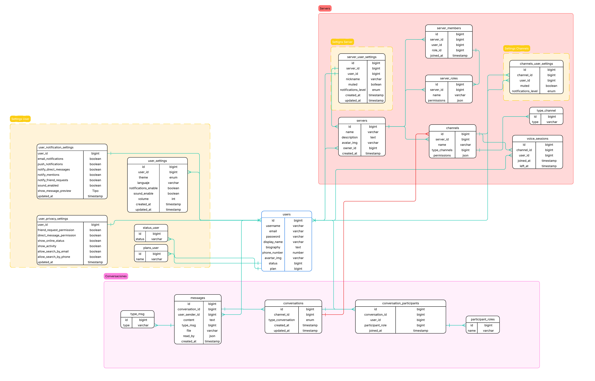

**Diagrama de Modelo relacional desglosado**

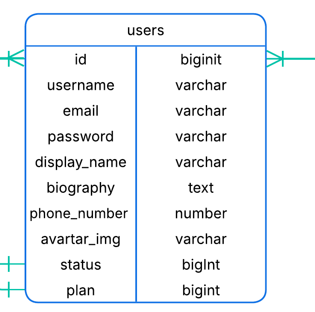

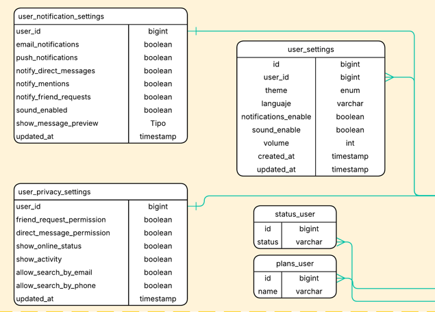

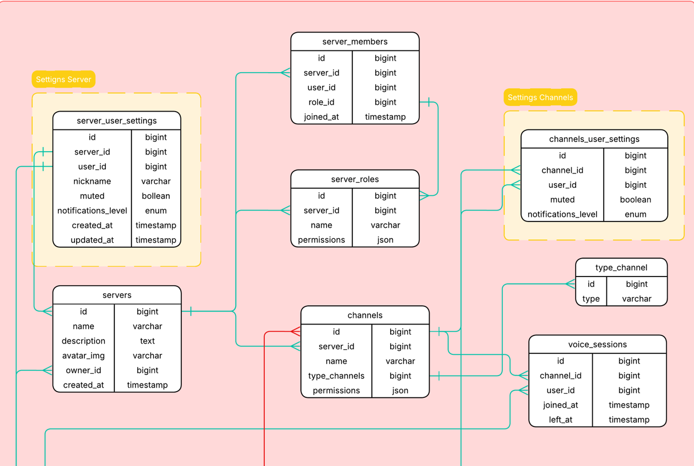

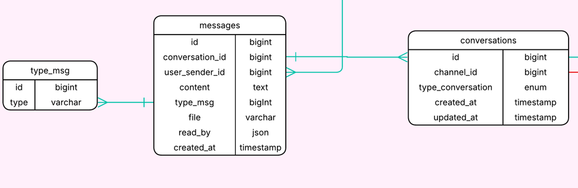

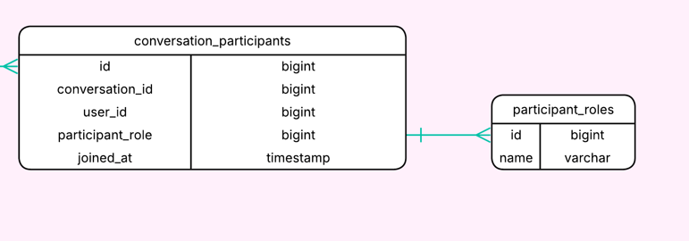

### Diagrama de clases UML  

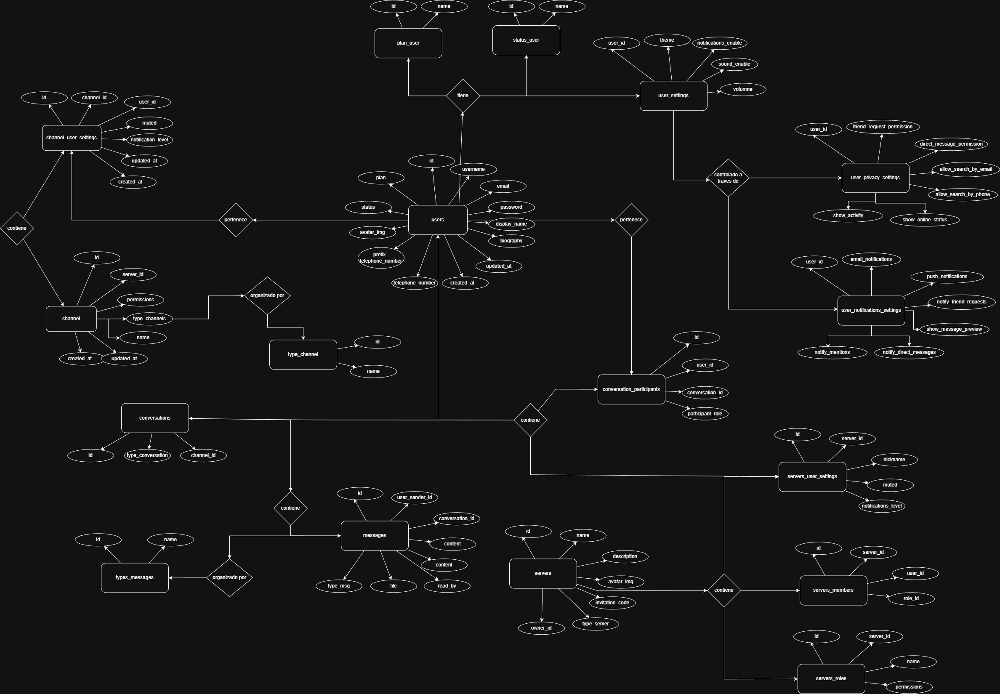

**Diagrama de casos de uso desglosado**

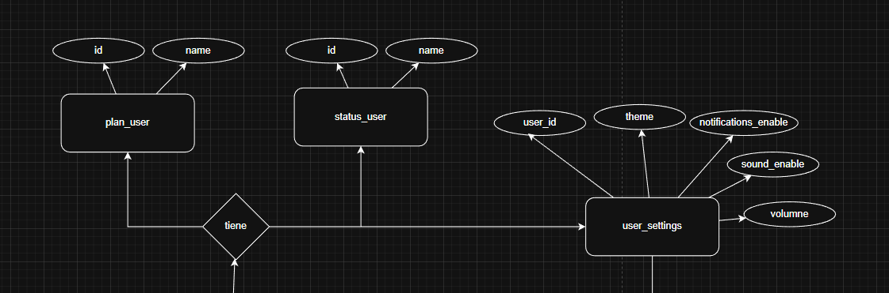

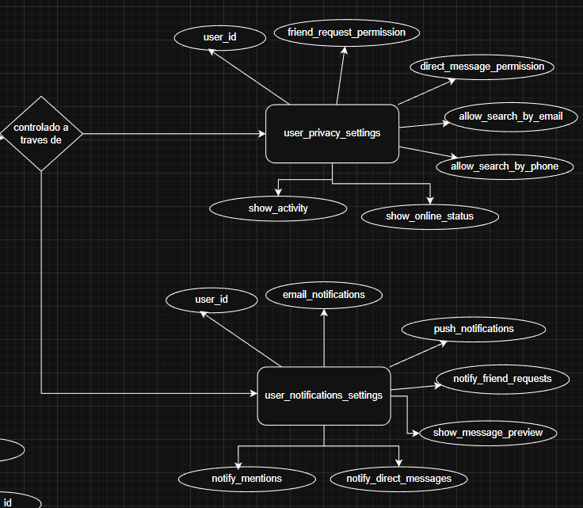

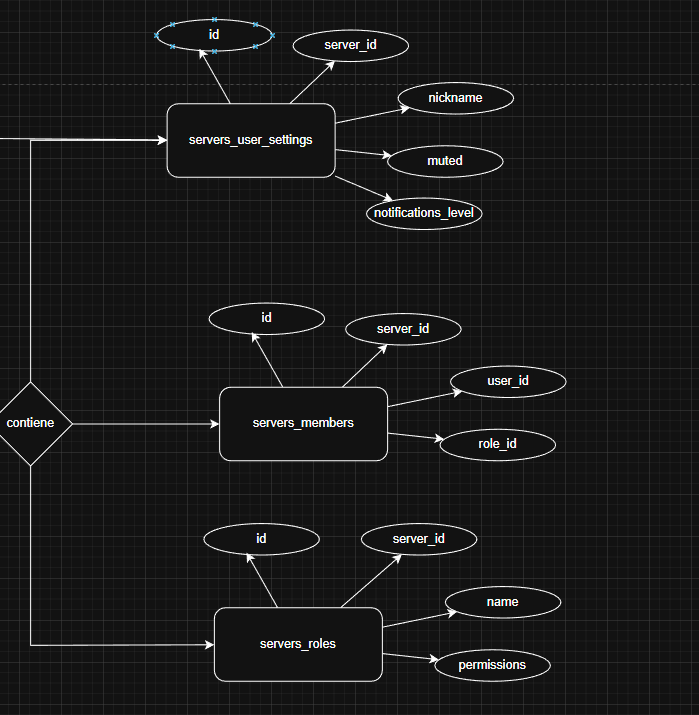

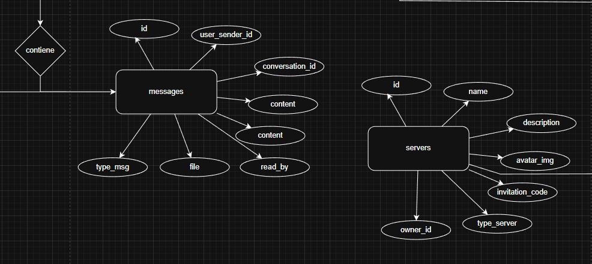

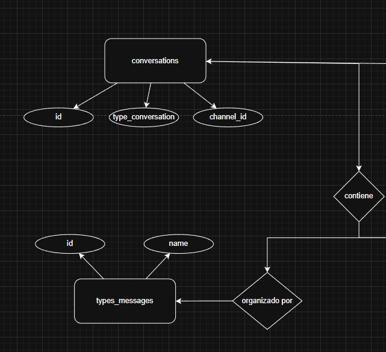

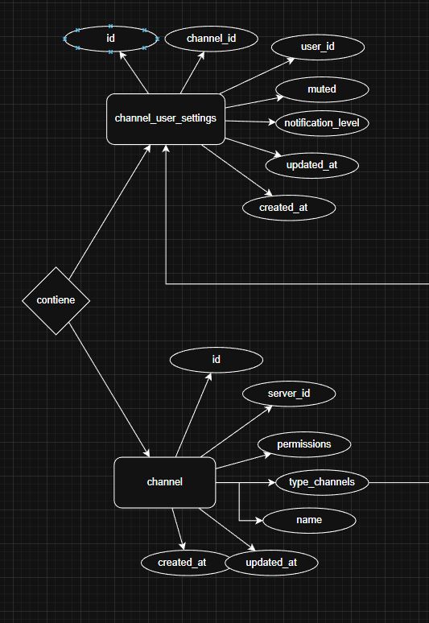

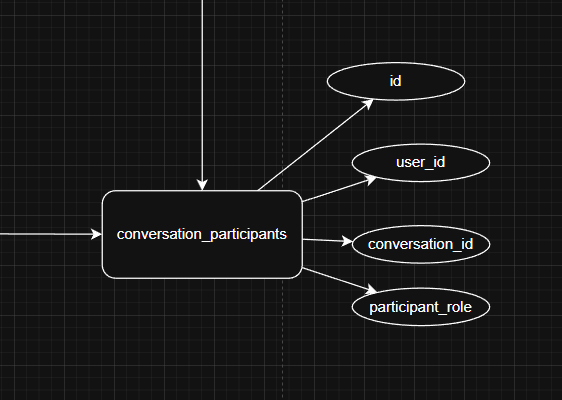

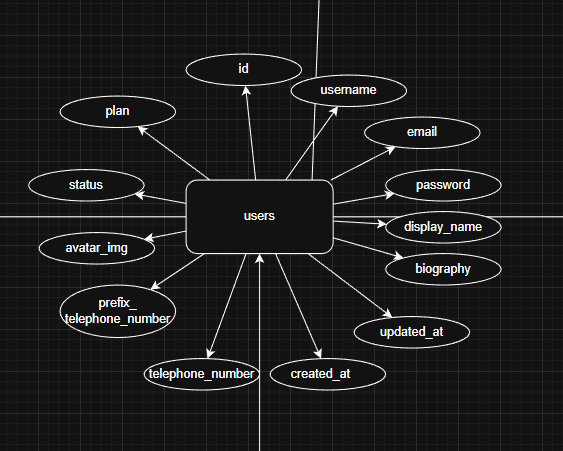

---

## Diseño de Interfaz

Se ha diseñado la landing cuidando especialmente la jerarquía visual, destacando el mensaje principal (“Habla, conecta, comparte. Todo en vivo.”) como foco inicial, y acompañándolo de elementos secundarios como los planes y los botones, que tienen un mayor contraste para dirigir la acción del usuario.  

También he estructurado el diseño siguiendo un flujo visual en patrón Z, empezando por el logo y la navegación en la parte superior, pasando por el titular principal y terminando en los botones de acción, de forma que la lectura sea natural e intuitiva.  

En cuanto a la accesibilidad, he utilizado contrastes adecuados entre el fondo y el texto para asegurar la legibilidad, y he diseñado los botones para que sean fácilmente identificables tanto por color como por forma.  

He mantenido una consistencia visual en toda la interfaz, reutilizando estilos de tipografía, colores y componentes como las tarjetas de planes, para que la experiencia sea coherente.  

Por último, he trabajado el espaciado usando márgenes y padding suficientes para evitar la sobrecarga visual, permitiendo que cada elemento respire y facilitando la comprensión del contenido.  

**Boceto de Landig Page**  

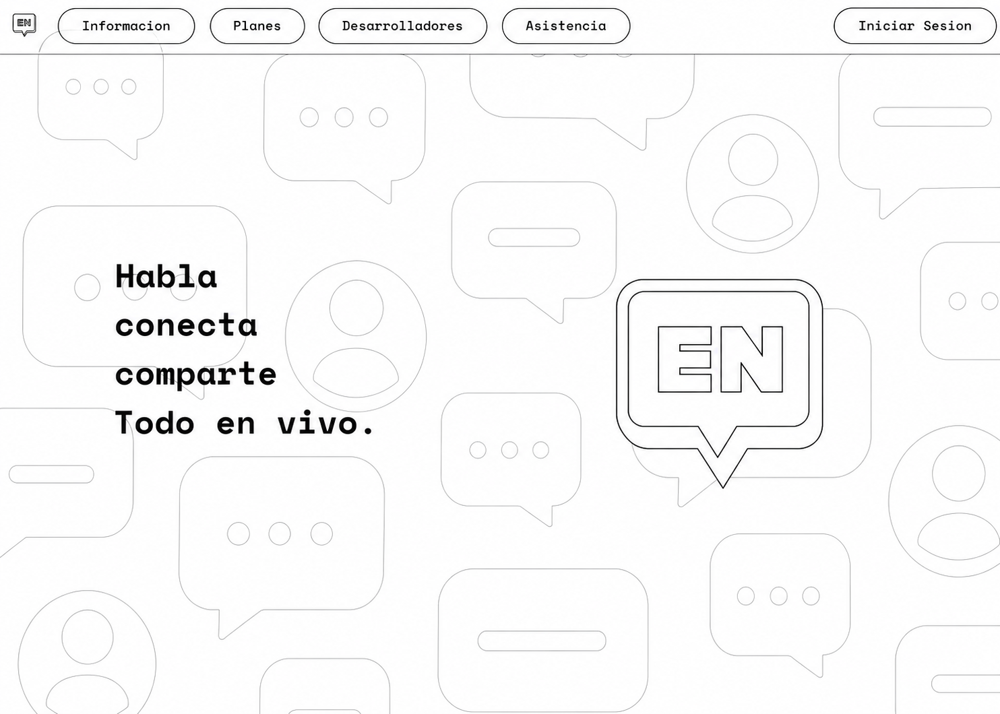  

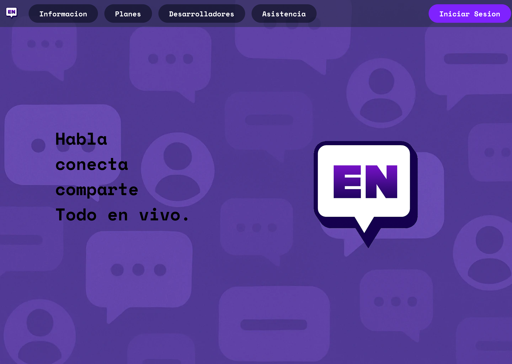  

**Boceto de la selección de Planes**  

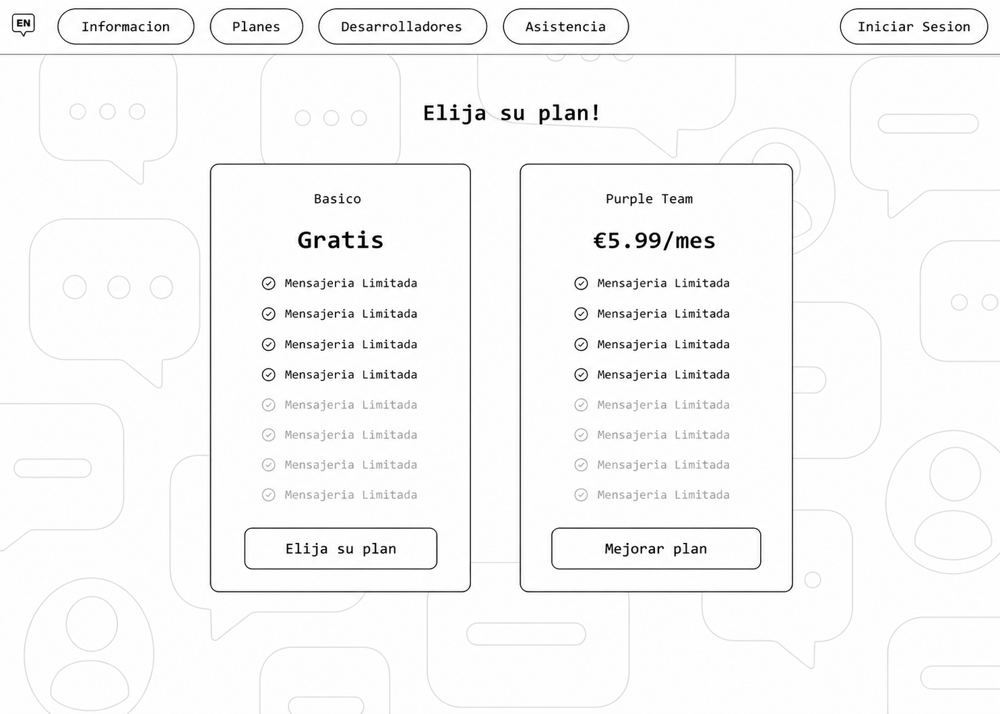  

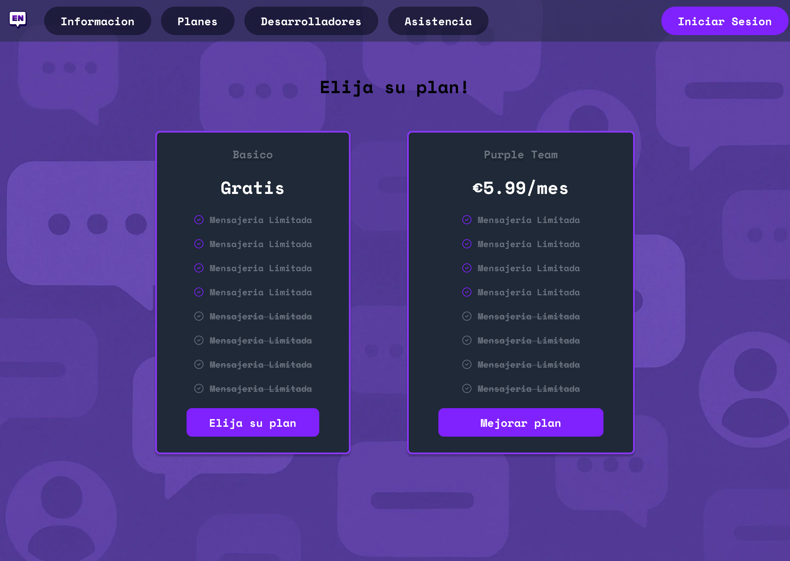  

---
# Desarrollo e Implementación

## Organización real del trabajo  
## Estructura del Proyecto  
## Aspectos relevantes de la codificación  
## Despliegue  
## Plan de Prevención de Riesgos Laborales

Este documento recoge las medidas básicas de prevención de riesgos aplicadas durante el desarrollo del proyecto EchoNow, centrado en trabajo con equipos informáticos y desarrollo software.

## Análisis del puesto

La actividad principal del proyecto consiste en el desarrollo de una aplicación web en tiempo real, utilizando tecnologías como Laravel, React y herramientas de contenedorización. El trabajo se realiza frente a un ordenador durante periodos prolongados, lo que implica una exposición continua a pantallas y una interacción constante con dispositivos de entrada como teclado y ratón.

Este tipo de actividad conlleva principalmente riesgos ergonómicos derivados de la postura mantenida en el tiempo. Una mala colocación de la silla, una altura incorrecta de la mesa o una posición inadecuada de la pantalla pueden provocar molestias en la espalda, cuello y extremidades superiores. A esto se suma la fatiga visual causada por la exposición prolongada a pantallas, especialmente en condiciones de iluminación no óptimas.

También se identifican riesgos asociados al entorno físico de trabajo, como la presencia de cables, la organización del espacio o la ventilación. Aunque el nivel de peligrosidad es bajo en comparación con otros sectores, estos factores pueden derivar en incidentes si no se controlan adecuadamente.

Por otro lado, el desarrollo de software implica una carga mental considerable. La resolución de problemas, la presión por plazos y la necesidad de mantener la concentración durante largos periodos pueden generar fatiga mental y estrés si no se gestionan correctamente.

---
## Medidas adoptadas

Para reducir los riesgos detectados, se han aplicado una serie de ajustes en el puesto de trabajo orientados principalmente a la ergonomía. La silla se ajusta en altura para permitir una posición cómoda, manteniendo la espalda recta y los pies apoyados. La pantalla se sitúa a la altura de los ojos para evitar inclinaciones del cuello, y se mantiene una distancia adecuada que facilite la lectura sin forzar la vista.

Además, se cuida la disposición de los elementos de trabajo para que el acceso al teclado y al ratón sea natural, evitando tensiones innecesarias en muñecas y brazos. En aquellos casos en los que es necesario, se utilizan elementos auxiliares como reposapiés para mejorar la postura general.

Estas medidas no eliminan completamente el riesgo, pero sí lo reducen significativamente, especialmente cuando se mantienen de forma constante a lo largo del tiempo.

---
## Planificación de descansos

Uno de los aspectos más importantes en este tipo de actividad es la gestión de los tiempos de descanso. El trabajo continuado frente a la pantalla puede generar fatiga tanto física como mental, por lo que se establecen pausas periódicas durante la jornada.

Se realizan descansos breves de forma regular, lo que permite reducir la tensión acumulada y mejorar la concentración. Además, se aplica la regla 20-20-20, que consiste en apartar la vista de la pantalla cada cierto tiempo y enfocar a una distancia lejana durante unos segundos, ayudando a reducir la fatiga ocular.

Estos descansos también se aprovechan para cambiar de postura o realizar pequeños movimientos, lo que contribuye a prevenir molestias musculares y mejora el bienestar general durante la jornada.

---
## Gestión de carga mental

El desarrollo del proyecto requiere mantener un alto nivel de concentración y afrontar tareas que pueden resultar complejas. Para evitar situaciones de estrés o sobrecarga, se organiza el trabajo de forma estructurada, utilizando metodologías que permiten dividir las tareas y establecer prioridades claras.

La planificación previa y la organización del trabajo ayudan a evitar acumulaciones innecesarias de tareas, reduciendo la presión y facilitando un ritmo de trabajo más equilibrado. Asimismo, se intenta mantener una distribución razonable de la carga de trabajo, evitando jornadas excesivamente largas que puedan afectar al rendimiento y a la salud.

El objetivo no es únicamente mejorar la productividad, sino también garantizar que el desarrollo del proyecto se realice en condiciones sostenibles a lo largo del tiempo.

---
## Seguridad física

El entorno de trabajo se mantiene en condiciones adecuadas para evitar riesgos innecesarios. Se presta especial atención al orden del espacio, evitando la acumulación de objetos y asegurando que los elementos necesarios estén correctamente organizados.

Los cables de los equipos se colocan de forma que no interfieran en el paso ni generen riesgo de tropiezos. También se tiene en cuenta la ventilación del espacio, especialmente en entornos donde se utilizan varios dispositivos electrónicos, con el fin de evitar el sobrecalentamiento y mejorar el confort.

En cuanto al uso de equipos eléctricos, se procura utilizar dispositivos en buen estado y evitar la sobrecarga de enchufes, reduciendo así el riesgo de fallos eléctricos o incidencias mayores.

---
## Seguridad digital

Además de los riesgos físicos, en el desarrollo del proyecto se tienen en cuenta aspectos relacionados con la seguridad digital. Aunque no afectan directamente a la salud física, forman parte de un entorno de trabajo seguro y controlado.

Se aplican buenas prácticas en el desarrollo del software, como la validación de datos para evitar comportamientos inesperados, el uso de variables de entorno para proteger información sensible y la implementación de mecanismos de autenticación que controlen el acceso al sistema.

También se mantiene una gestión adecuada de las herramientas utilizadas, asegurando que el entorno de desarrollo sea estable y evitando configuraciones que puedan comprometer la seguridad o el correcto funcionamiento del sistema.

---
## Conclusión

El desarrollo de software, aunque no presenta riesgos elevados en términos físicos, sí implica una serie de factores que pueden afectar a la salud si no se gestionan adecuadamente. La combinación de medidas ergonómicas, una correcta organización del trabajo y la atención al entorno físico permite reducir estos riesgos de forma considerable.

La prevención en este contexto no debe entenderse como una obligación puntual, sino como un conjunto de hábitos que se aplican de forma continua. Mantener buenas prácticas durante el desarrollo del proyecto no solo mejora la seguridad, sino que también contribuye a un mejor rendimiento y a una mayor calidad del trabajo realizado.

---
# Glosario de Términos y Acrónimos  

Glosario dedicado a la definición y/o explicación de nuevos de *términos - acrónimos - siglas*.    

| Palabra   | Significado                                                                                                                                                                                                      |
| --------- | ---------------------------------------------------------------------------------------------------------------------------------------------------------------------------------------------------------------- |
| VOIP      | Voz sobre Protocolo de Internet                                                                                                                                                                                  |
| Framework | Conjunto estandarizado de herramientas, librerías, módulos y buenas prácticas prediseñadas que proporcionan una estructura base para desarrollar software                                                        |
| API       | (Interfaz de Programación de Aplicaciones) es un conjunto de reglas y protocolos que permite a distintas aplicaciones informáticas comunicarse                                                                   |
| IA        | Inteligencia Artificial                                                                                                                                                                                          |
| WebSocket | Protocolo de comunicación bidireccional (full-duplex) y persistente que permite el intercambio de datos en tiempo real entre un cliente (como un navegador web) y un servidor a través de una única conexión TCP |